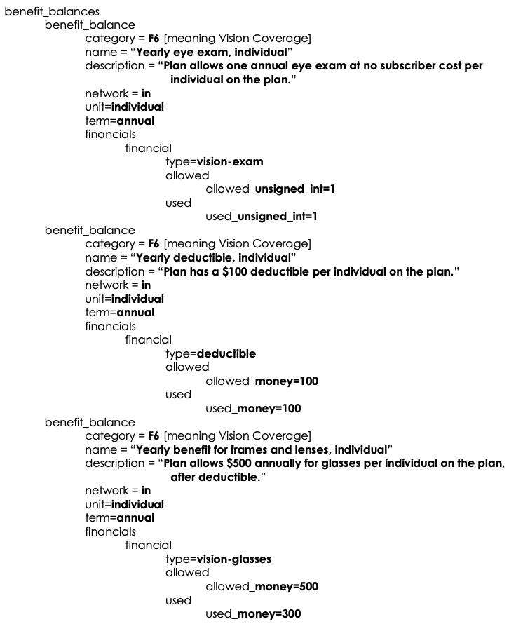
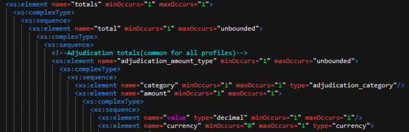
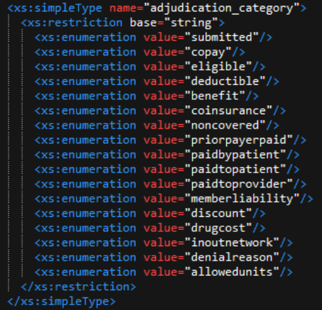
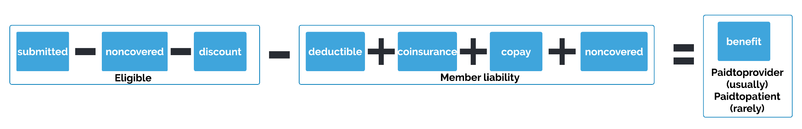
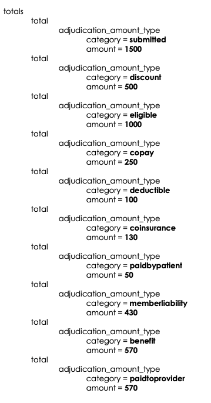
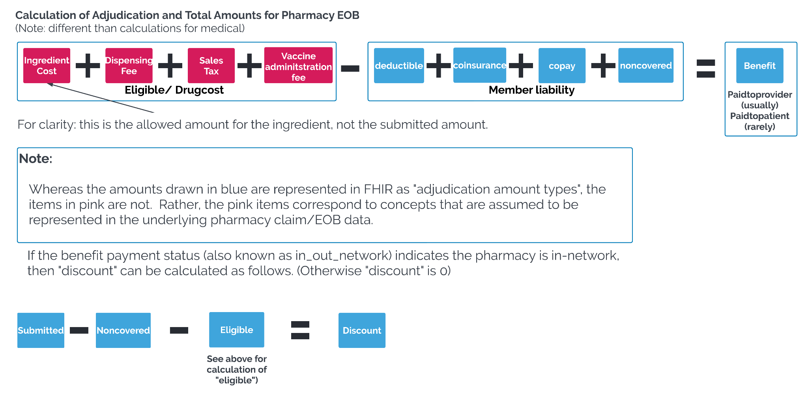
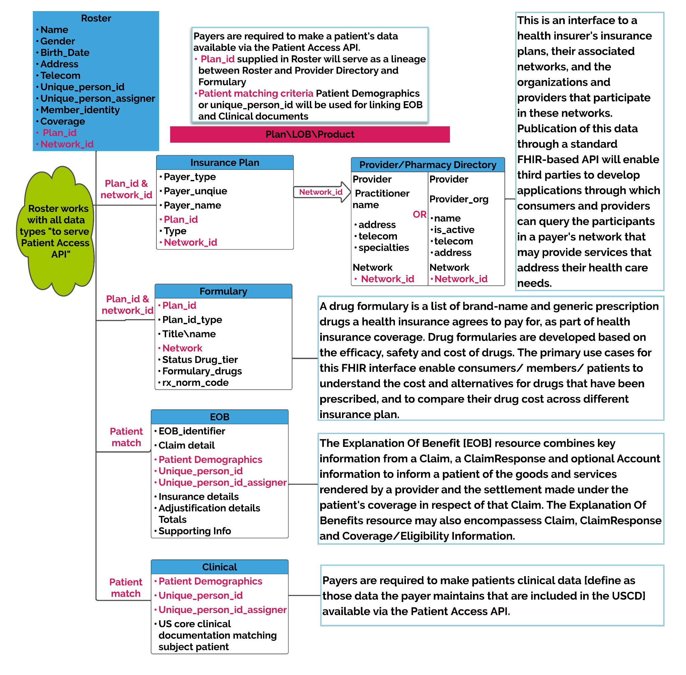

# EOB_V6.0 Implementation Guide

**HLX0123 HLX EOB_V6.0 IG (XSD_V6.0)**

**Version 6.0**

**May 29, 2026**

**Table of Contents**

1. [Overview](#overview)
2. [Encoding](#encoding)
3. [Interoperability](#interoperability)
4. [Change Log](#change-log)
5. [Simple Types](#simple-types)
6. [Complex Types](#complex-types)
7. [Required Elements of EOB_V6.0 XSD](#required-elements-of-eob_v6.0-xsd)
8. [Profile-Based Required Data Elements](#profile-based-required-data-elements)
9. [Type/Sub-Type Dependencies](#type-subtype-dependencies)
10. [All Elements of EOB_V6.0 XSD](#all-elements-of-eob_v6.0-xsd)
11. [Submission Frequency](#submission-frequency)
12. [Customer Guidance](#customer-guidance)
13. [Identification of a Patient](#identification-of-a-patient)
14. [Adds, Updates, and Deletes](#adds-updates-and-deletes)
15. [Member Identification](#member-identification)
16. [Appendix A – Value Sets](#appendix-a-value-sets)
17. [Appendix B – Architecture](#appendix-b-architecture)
18. [Appendix C – Benefit Balances](#appendix-c-benefit-balances)
19. [Appendix D – Representing Totals](#appendix-d-representing-totals)
   - [Total Mathematical Illustration: Medical EOB](#total-mathematical-illustration-medical-eob)
   - [Total Mathematical Illustration: Pharmacy EOB](#total-mathematical-illustration-pharmacy-eob)
20. [Appendix Overall Implementation](#appendix-overall-implementation)

<h2 style="color:#E60073">Disclaimer</h2>

This document is provided by HealthLX for informational purposes only. Information within this document is believed to be correct as of the noted date of publication. Although HealthLX makes every reasonable effort to present information in a timely and accurate manner, HealthLX does not warrant this information for accuracy, completeness or fitness for any purpose, express or implied. The information provided herein does not constitute the rendering of legal, financial or other professional advice or recommendations by HealthLX.

<h2 id="overview" style="color:#E60073">Overview</h2>

This implementation guide provides field mappings and requirements for HealthLX EOB_V6.0 data submissions in XML format based on [https://www.hl7.org/fhir/R4/](https://www.hl7.org/fhir/R4/) standards. XML format enables structured data exchange with built-in validation against the provided XSD schema.

<h2 id="encoding" style="color:#E60073">Encoding</h2>

Payers need to send their files with utf-8 encoding as shown below:

```xml
<?xml version="1.0" encoding="utf-8"?>
```

<h2 id="interoperability" style="color:#E60073">Interoperability</h2>

This implementation guide is based on constructs presented in [https://www.hl7.org/fhir/R4/](https://www.hl7.org/fhir/R4/) (Fast Healthcare Interoperability Resources Release 4) and associated FHIR Implementation Guides, such as those found in Da Vinci and CARIN.

For more information regarding these underlying standards, please visit:

- FHIR R4: [https://www.hl7.org/fhir/R4/](https://www.hl7.org/fhir/R4/)
- Da Vinci Project: [https://confluence.hl7.org/display/DVP/Da+Vinci+Welcome](https://confluence.hl7.org/display/DVP/Da+Vinci+Welcome)
- CARIN Alliance: [https://confluence.hl7.org/display/CAR/CARIN+Alliance+Implementation+Guides](https://confluence.hl7.org/display/CAR/CARIN+Alliance+Implementation+Guides)

<h2 id="change-log" style="color:#E60073">Change Log</h2>

| Version | Date |
|---------|------|
| manual | May 29, 2026 |
{: .heatMap}

<h2 id="simple-types" style="color:#E60073"> Simple Types</h2>

| Name | Base Type | Description | Pattern |
| --- | --- | --- | --- |
| string | xs:string | – | [ \r\n\t\S]+ |
| NPI | xs:string | – | [0-9]{10} |
| positiveInt | xs:positiveInteger | – | \+?[1-9][0-9]* |
| unsignedInt | xs:unsignedInt | – | 0\|([1-9][0-9]*) |
| integer | xs:integer | – | [0]\|[-+]?[1-9][0-9]* |
| time | xs:time | – | ([01][0-9]\|2[0-3]):[0-5][0-9]:[0-5][0-9](\.\d{1,9})? |
| dateTime | xs:string | – | ([12]\d{3})-(0[1-9]\|1[0-2])-(0[1-9]\|[1-2][0-9]\|3[0-1])(T([01][0-9]\|2[0-3]):[0-5][0-9]:[0-5][0-9](\.\d{1,6})?((Z\|(\+\|-)((0[0-9]\|1[0-3]):(00\|15\|30\|45)\|14:00))?))? |
| date | xs:date | – | ([12]\d{3}-(0[1-9]\|1[0-2])-(0[1-9]\|[12]\d\|3[01])) |
| decimal | xs:decimal | – | -?(0\|[1-9][0-9]*)(\.[0-9]+)?([eE][+-]?[0-9]+)? |
| boolean | xs:boolean | – | true\|false |
| currency | string | – |  |
| adjudication_category | string | – |  |
| language | string | – |  |
| reference | string | – |  |
{: .heatMap}


<h2 id="complex-types" style="color:#E60073"> Complex Types</h2>

<h3 style="color:#E60073">period</h3>

| Field Name | Type | MinOccurs | MaxOccurs | Description |
| --- | --- | --- | --- | --- |
| start | dateTime | 0 | 1 | – |
| end | dateTime | 0 | 1 | – |
{: .heatMap}


<h3 style="color:#E60073">identifier</h3>

| Field Name | Type | MinOccurs | MaxOccurs | Description |
| --- | --- | --- | --- | --- |
| value | string | 1 | 1 | – |
| type | string | 0 | 1 | – |
| system | string | 0 | 1 | – |
{: .heatMap}


<h3 style="color:#E60073">eob_identifier</h3>

| Field Name | Type | MinOccurs | MaxOccurs | Description |
| --- | --- | --- | --- | --- |
| value | string | 1 | 1 | – |
| type | – | 1 | 1 | – |
{: .heatMap}


<h3 style="color:#E60073">timing</h3>

| Field Name | Type | MinOccurs | MaxOccurs | Description |
| --- | --- | --- | --- | --- |
| timing_date | date | 0 | 1 | – |
| timing_period | period | 0 | 1 | – |
{: .heatMap}


<h3 style="color:#E60073">quantity</h3>

| Field Name | Type | MinOccurs | MaxOccurs | Description |
| --- | --- | --- | --- | --- |
| value | decimal | 0 | 1 | – |
| comparator | string | 0 | 1 | – |
| unit | string | 0 | 1 | – |
| system | string | 0 | 1 | – |
| code | string | 0 | 1 | – |
{: .heatMap}


<h3 style="color:#E60073">value</h3>

| Field Name | Type | MinOccurs | MaxOccurs | Description |
| --- | --- | --- | --- | --- |
| value_boolean | boolean | 0 | 1 | – |
| value_string | string | 0 | 1 | – |
| value_quantity | quantity | 0 | 1 | – |
| value_reference | – | 0 | 1 | – |
| reference | string | 0 | 1 | – |
| type | string | 0 | 1 | – |
| identifier | identifier | 0 | 1 | – |
| display | string | 0 | 1 | – |
{: .heatMap}


<h3 style="color:#E60073">human_name</h3>

| Field Name | Type | MinOccurs | MaxOccurs | Description |
| --- | --- | --- | --- | --- |
| use | – | 0 | 1 | Use this element to describe the name. More information can be found here: [http://hl7.org/fhir/R4/valueset-name-use.html](http://hl7.org/fhir/R4/valueset-name-use.html) |
| text | string | 0 | 1 | Use this element to enter the entire name |
| family | string | 1 | 1 | Family name (often called 'Surname') |
| given | string | 1 | unbounded | Given names (not always 'first'). Includes middle names |
| prefix | string | 0 | unbounded | – |
| suffix | string | 0 | unbounded | – |
| period | period | 0 | 1 | Time period when name was/is in use. If the name is still in use, do not supply an End date |
{: .heatMap}


<h3 style="color:#E60073">address</h3>

| Field Name | Type | MinOccurs | MaxOccurs | Description |
| --- | --- | --- | --- | --- |
| use | – | 0 | 1 | The use of this address. More information can be found here: [http://hl7.org/fhir/R4/valueset-address-use.html](http://hl7.org/fhir/R4/valueset-address-use.html) |
| type | – | 0 | 1 | The type of address. More information can be found here: [http://hl7.org/fhir/R4/valueset-address-type.html](http://hl7.org/fhir/R4/valueset-address-type.html) |
| text | string | 0 | 1 | Use this element to list the address in it's entirety (e.g. 123 Test Way City, State 12345) |
| line | string | 1 | unbounded | – |
| city | string | 1 | 1 | Name of city, town etc. |
| district | string | 0 | 1 | Use this element to list the District name (aka county) |
| state | string | 0 | 1 | Sub-unit of country (abbreviations ok) |
| postal_code | string | 1 | 1 | The postal code or post code of the address. The postal code supports an unlimited amount of numbers and letters. |
| country | xs:string | 0 | 1 | Country (e.g. can be ISO 3166 2 or 3 letter code) |
| period | period | 0 | 1 | – |
{: .heatMap}


<h3 style="color:#E60073">telecom</h3>

| Field Name | Type | MinOccurs | MaxOccurs | Description |
| --- | --- | --- | --- | --- |
| system | – | 1 | 1 | Use this element to descripbe the contact point. [https://www.hl7.org/fhir/valueset-contact-point-system.html](https://www.hl7.org/fhir/valueset-contact-point-system.html) |
| value | string | 1 | 1 | The actual value of the contact point |
| use | – | 0 | 1 | The use of the contact point. [https://www.hl7.org/fhir/valueset-contact-point-use.html](https://www.hl7.org/fhir/valueset-contact-point-use.html) |
| rank | positiveInt | 0 | 1 | Specify preferred order of use (1 = highest) |
| period | period | 0 | 1 | Time period when the contact point was/is in use |
{: .heatMap}


<h3 style="color:#E60073">practitioner</h3>

| Field Name | Type | MinOccurs | MaxOccurs | Description |
| --- | --- | --- | --- | --- |
| npi | NPI | 0 | 1 | National Provider Identifier (NPI) |
| tax | string | 0 | unbounded | An identifier for the person as this agent |
| names | – | 1 | 1 | – |
| name | human_name | 1 | unbounded | – |
| reference | string | 1 | 1 | – |
| telecoms | – | 0 | 1 | – |
| telecom | telecom | 0 | unbounded | – |
| addresses | – | 0 | 1 | – |
| address | address | 0 | unbounded | – |
{: .heatMap}


<h3 style="color:#E60073">organization</h3>

| Field Name | Type | MinOccurs | MaxOccurs | Description |
| --- | --- | --- | --- | --- |
| npi | NPI | 0 | 1 | National Provider Identifier (NPI) |
| clia | string | 0 | 1 | Clinical Laboratory Improvement Amendments (CLIA) Number for laboratories |
| tax | identifier | 0 | unbounded | Tax Id Number |
| naic_code | identifier | 0 | unbounded | – |
| payer_id | identifier | 0 | unbounded | – |
| is_active | boolean | 1 | 1 | – |
| name | string | 1 | 1 | – |
| alias | string | 0 | unbounded | – |
| telecoms | – | 0 | 1 | – |
| telecom | telecom | 0 | unbounded | – |
| addresses | – | 0 | 1 | – |
| address | address | 0 | unbounded | – |
{: .heatMap}


<h3 style="color:#E60073">member_person</h3>

| Field Name | Type | MinOccurs | MaxOccurs | Description |
| --- | --- | --- | --- | --- |
| member_id | string | 1 | 1 | Use this element to list the Member ID . |
| member_id_system | string | 0 | 1 | Use this element to identify the system that issues the Member ID . |
| subscriber_id | string | 1 | 1 | Use this element to list the Subscriber ID. |
| unique_person_id | string | 0 | 1 | This is the person's unique member number in the Payer system across plans. This number is not reused for anyone else. |
| unique_person_id_assigner | string | 0 | 1 | Organization that issued id |
| unique_person_id_assigner_type | string | 0 | 1 | Type of organization that issued id |
| names | – | 1 | 1 | – |
| name | human_name | 1 | unbounded | – |
| gender | – | 1 | 1 | Use this element for Gender (male, female, other or unknown) |
| birth_date | xs:date | 1 | 1 | Birth date (1900-01-01) |
| marital_status | – | 0 | 1 | Marital Status, more information can be found here: [http://hl7.org/fhir/R4/valueset-marital-status.html](http://hl7.org/fhir/R4/valueset-marital-status.html) |
| deceased | – | 0 | 1 | – |
| is_deceased | boolean | 0 | 1 | – |
| deceased_date_time | dateTime | 0 | 1 | – |
| telecoms | – | 0 | 1 | – |
| telecom | telecom | 0 | unbounded | – |
| addresses | – | 1 | 1 | – |
| address | address | 1 | unbounded | – |
| communications | – | 0 | 1 | – |
| communication | – | 0 | unbounded | – |
| language | – | 1 | 1 | This value set includes common codes from BCP-47 ([http://tools.ietf.org/html/bcp47](http://tools.ietf.org/html/bcp47)). More information can be found here: [http://hl7.org/fhir/R4/valueset-languages.html](http://hl7.org/fhir/R4/valueset-languages.html) |
| language_code | language | 1 | 1 | – |
| system | – | 0 | 1 | – |
| display | string | 0 | 1 | Description |
| is_preferred | boolean | 0 | 1 | Is this language the preferred language (true/false) |
| us_core_race | – | 0 | 1 | – |
| omb_category_code | – | 0 | 5 | This element is for selecting 1 of the 5 OMB race category codes that can be found here: [http://hl7.org/fhir/us/core/ValueSet-detailed-race.html](http://hl7.org/fhir/us/core/ValueSet-detailed-race.html) |
| code | – | 1 | 1 | – |
| system | – | 0 | 1 | – |
| detailed_code | – | 0 | unbounded | This element is for selecting 1 of the additional expansion codes that can be found here: [http://hl7.org/fhir/us/core/ValueSet-detailed-race.html](http://hl7.org/fhir/us/core/ValueSet-detailed-race.html) |
| text | string | 1 | 1 | Use this element for adding a text description |
| us_core_ethnicity | – | 0 | 1 | – |
| omb_category_code | – | 0 | 1 | This element is for selecting 1 of the OMB ethnicity category codes that can be found here: [http://hl7.org/fhir/us/core/ValueSet-omb-ethnicity-category.html](http://hl7.org/fhir/us/core/ValueSet-omb-ethnicity-category.html) |
| detailed_code | – | 0 | unbounded | This element is for selecting 1 of the additional ethnicity codes from the CDC that can be found here: [https://www.hl7.org/fhir/us/core/ValueSet-detailed-ethnicity.html](https://www.hl7.org/fhir/us/core/ValueSet-detailed-ethnicity.html) |
| text | string | 1 | 1 | Use this element for adding a text description if the ethnicity is not listed within the enummeration |
| us_core_birth_sex | – | 0 | 1 | This element is used for selecting birth sex (M = Male, F = Female, UNK = Unknown) |
{: .heatMap}


<h3 style="color:#E60073">subscriber_person</h3>

| Field Name | Type | MinOccurs | MaxOccurs | Description |
| --- | --- | --- | --- | --- |
| member_id | string | 0 | 1 | Use this element to list the Member ID . |
| member_id_system | string | 0 | 1 | Use this element to identify the system that issues the Member ID . |
| subscriber_id | string | 1 | 1 | Use this element to list the Subscriber ID. |
| unique_person_id | string | 0 | 1 | This is the person's unique member number in the Payer system across plans. This number is not reused for anyone else. |
| unique_person_id_assigner | string | 0 | 1 | Organization that issued id |
| unique_person_id_assigner_type | string | 0 | 1 | Type of organization that issued id |
| names | – | 1 | 1 | – |
| name | human_name | 1 | unbounded | – |
| gender | – | 0 | 1 | Use this element for Gender (male, female, other or unknown) |
| birth_date | xs:date | 0 | 1 | Birth date (1900-01-01) |
| marital_status | – | 0 | 1 | Marital Status, more information can be found here: [http://hl7.org/fhir/R4/valueset-marital-status.html](http://hl7.org/fhir/R4/valueset-marital-status.html) |
| deceased | – | 0 | 1 | – |
| is_deceased | boolean | 0 | 1 | – |
| deceased_date_time | dateTime | 0 | 1 | – |
| telecoms | – | 0 | 1 | – |
| telecom | telecom | 0 | unbounded | – |
| addresses | – | 0 | 1 | – |
| address | address | 0 | unbounded | – |
| communications | – | 0 | 1 | – |
| communication | – | 0 | unbounded | – |
| language_code | language | 1 | 1 | This value set includes common codes from BCP-47 ([http://tools.ietf.org/html/bcp47](http://tools.ietf.org/html/bcp47)). More information can be found here: [http://hl7.org/fhir/R4/valueset-languages.html](http://hl7.org/fhir/R4/valueset-languages.html) |
| is_preferred | boolean | 0 | 1 | Is this language the preferred language (true/false) |
| display | string | 0 | 1 | Description |
| us_core_race | – | 0 | 1 | – |
| omb_category_code | – | 0 | 5 | This element is for selecting 1 of the 5 OMB race category codes that can be found here: [http://hl7.org/fhir/us/core/ValueSet-detailed-race.html](http://hl7.org/fhir/us/core/ValueSet-detailed-race.html) |
| detailed_code | – | 0 | unbounded | This element is for selecting 1 of the additional expansion codes that can be found here: [http://hl7.org/fhir/us/core/ValueSet-detailed-race.html](http://hl7.org/fhir/us/core/ValueSet-detailed-race.html) |
| text | string | 1 | 1 | Use this element for adding a text description |
| us_core_ethnicity | – | 0 | 1 | – |
| omb_category_code | – | 0 | 1 | This element is for selecting 1 of the OMB ethnicity category codes that can be found here: [http://hl7.org/fhir/us/core/ValueSet-omb-ethnicity-category.html](http://hl7.org/fhir/us/core/ValueSet-omb-ethnicity-category.html) |
| detailed_code | – | 0 | unbounded | This element is for selecting 1 of the additional ethnicity codes from the CDC that can be found here: [https://www.hl7.org/fhir/us/core/ValueSet-detailed-ethnicity.html](https://www.hl7.org/fhir/us/core/ValueSet-detailed-ethnicity.html) |
| text | string | 1 | 1 | Use this element for adding a text description if the ethnicity is not listed within the enummeration |
| us_core_birth_sex | – | 0 | 1 | This element is used for selecting birth sex (M = Male, F = Female, UNK = Unknown) |
{: .heatMap}


<h2 id="required-elements-of-eob_v6.0-xsd" style="color:#E60073">Required Elements of EOB_V6.0 XSD</h2>

| Name | Parent | Cardinality | Description | Examples | Data Type |
| --- | --- | --- | --- | --- | --- |
| eob_list |  | 1..1 | – | – | – |
| schema_version | eob_list | 1..1 | This element defines what version of the EOB schema you will be validating against (e.g. 1.0) | – | xs:decimal |
| sender_id | eob_list | 1..1 | This element is used to the unique identifier assigned to your organization | – | string |
| date_time_reported | eob_list | 1..1 | This element is used to the identify the date time this information was reported (e.g. 2001-10-26T21:32:52+02:00) | – | xs:dateTime |
| eob | eob_list | 1..unbounded | – | – | – |
| eob_identifier | eob | 1..1 | This is a unique business identifier assigned to the EOB. In the event, that this EOB changes in either status or content, the replacement EOB would be expected to have the same identifier. | – | eob_identifier |
| status | eob | 1..1 | Claim processing status code | – | – |
| type | eob | 1..1 | Claim type code (institutional, oral, pharmacy, professional or vision) | – | – |
| use | eob | 1..1 | The purpose of the Claim: predetermination, preauthorization, claim. More information can be found here: [http://hl7.org/fhir/R4/valueset-claim-use.html](http://hl7.org/fhir/R4/valueset-claim-use.html) | – | – |
| created | eob | 1..1 | – | – | dateTime |
| outcome | eob | 1..1 | This value set includes Claim Processing Outcome codes. More information can be found here: [http://hl7.org/fhir/R4/valueset-remittance-outcome.html](http://hl7.org/fhir/R4/valueset-remittance-outcome.html) | – | – |
| claim | eob | 1..1 | – | – | – |
| identifier | claim | 1..unbounded | Please include the following claim identifiers -The Payer Claim Control Number as it would be returned on the 835 2100 CLP07. This number must apply to the entire claim. Please use an identifier.type of DCN. - If available, the Claim Identifier for Transmission Intermediaries as sent to the payer on the 837 2300 Ref*D9. Please use an identifier.type of D9 | – | identifier |
| patient | eob | 1..1 | – | – | – |
| insurer | eob | 1..1 | – | – | – |
| provider | eob | 1..1 | – | – | – |
| – | provider | – | One of: practitioner, providing_organization | – | choice |
| practitioner | provider | 1..1 | – | – | practitioner |
| providing_organization | provider | 1..1 | – | – | organization |
| relationship | related | 1..1 | How the reference claim is related (prior or replacedby) | – | – |
| reference | related | 1..1 | File or case reference (Identifier) | – | identifier |
| created | claim | 1..1 | claim creation date | – | dateTime |
| type | payee | 1..1 | Category of recipient | – | – |
| party | payee | 1..1 | – | – | – |
| – | party | – | One of: reference, practitioner, providing_organization, patient | – | choice |
| reference | party | 1..1 | – | – | string |
| practitioner | party | 1..1 | – | – | practitioner |
| providing_organization | party | 1..1 | – | – | organization |
| patient | party | 1..1 | – | – | member_person |
| provider | care_team | 1..1 | – | – | – |
| – | provider | – | One of: reference, practitioner, providing_organization | – | choice |
| reference | provider | 1..1 | – | – | string |
| practitioner | provider | 1..1 | – | – | practitioner |
| providing_organization | provider | 1..1 | – | – | organization |
| role | care_team | 1..1 | This element defines Function within the team,Enumuration set is combined list of possible code value set from each profile: Inpatient-Facility and Outpatient-Facility (primary,attending,performing,referring,operating,otheroperating), Pharmacy (prescribing,primary) and Professional-NonClinician (primary,performing,referring,supervisor,purchasedservice) | – | – |
| code | role | 1..1 | – | – | – |
| sequence | diagnosis | 1..1 | – | – | positiveInt |
| diagnosis_code | diagnosis | 1..1 | ICD-10 Codes | – | – |
| coding | diagnosis_code | 1..unbounded | – | – | – |
| code | coding | 1..1 | ICD-10-CM Diagnosis Codes-Large list of codes hence no enumeration included | – | string |
| sequence | procedure | 1..1 | – | – | positiveInt |
| procedure_code | procedure | 1..1 | – | – | – |
| coding | procedure_code | 1..unbounded | – | – | – |
| code | coding | 1..1 | – | – | string |
| insurances | eob | 1..1 | – | – | – |
| insurance | insurances | 1..unbounded | – | – | – |
| is_focal | insurance | 1..1 | Is Coverage to be used for adjudication | – | boolean |
| coverage | insurance | 1..1 | – | – | – |
| sequence | item | 1..1 | Item instance identifier | – | positiveInt |
| product_or_service | item | 1..1 | Current Procedural Terminology (CPT) - Healthcare Common Procedure Coding System (HCPCS) level II alphanumeric codes - Procedure Codes NDC or Compound | – | – |
| code | product_or_service | 1..1 | – | – | string |
| – | serviced | – | One of: serviced_date, serviced_period | – | choice |
| – | location | – | One of: location_codeable_concept, location_address, location_reference | – | choice |
| category | adjudication_amount_type | 1..1 | – | – | – |
| code | category | 1..1 | – | – | adjudication_category |
| code | denial_reason | 1..1 | – | – | – |
| system | denial_reason | 1..1 | – | – | – |
| reason | denial_reason | 1..1 | Adjudication Denial Reason | – | – |
| code | reason | 1..1 | – | – | string |
| category | allowed_units | 1..1 | – | – | – |
| code | category | 1..1 | – | – | – |
| system | category | 1..1 | – | – | – |
| category | in_out_network | 1..1 | Indicates the in network or out of network payment status of the claim. More info can be found here: [http://hl7.org/fhir/us/carin-bb/STU1/ValueSet-C4BBPayerBenefitPaymentStatus.html](http://hl7.org/fhir/us/carin-bb/STU1/ValueSet-C4BBPayerBenefitPaymentStatus.html) | – | – |
| category | adjudication_generic | 1..1 | – | – | – |
| code | category | 1..1 | – | – | adjudication_category |
| product_or_service | detail | 1..1 | Billing, service, product, or drug code | – | string |
| category | adjudication_amount_type | 1..1 | – | – | – |
| code | category | 1..1 | – | – | adjudication_category |
| amount | adjudication_amount_type | 1..1 | – | – | – |
| category | denial_reason | 1..1 | – | – | – |
| code | category | 1..1 | – | – | – |
| system | category | 1..1 | – | – | – |
| category | adjudication_generic | 1..1 | – | – | – |
| code | category | 1..1 | – | – | adjudication_category |
| totals | eob | 1..1 | – | – | – |
| total | totals | 1..unbounded | – | – | – |
| adjudication_amount_type | total | 1..unbounded | – | – | – |
| category | adjudication_amount_type | 1..1 | – | – | – |
| code | category | 1..1 | – | – | adjudication_category |
| system | category | 1..1 | – | – | – |
| amount | adjudication_amount_type | 1..1 | – | – | – |
| value | amount | 1..1 | – | – | decimal |
| category | in_out_network | 1..1 | – | – | – |
| code | category | 1..1 | Indicates the in network or out of network payment status of the claim. More info can be found here: : [http://hl7.org/fhir/us/carin-bb/STU1/ValueSet-C4BBPayerBenefitPaymentStatus.html](http://hl7.org/fhir/us/carin-bb/STU1/ValueSet-C4BBPayerBenefitPaymentStatus.html) | – | – |
| system | category | 1..1 | – | – | – |
| amount | in_out_network | 1..1 | – | – | – |
| value | amount | 1..1 | – | – | decimal |
| category | benefit_balance | 1..1 | Benefit Category Codes. More information can be found here: [http://hl7.org/fhir/R4/valueset-ex-benefitcategory.html](http://hl7.org/fhir/R4/valueset-ex-benefitcategory.html) Preferred code sets list: 1,2,3,4,5,14,23,24,25,26,27,28,30,35,36,37,49,55,56,61,62,63,69,76,F1,F3,F4,F6 | – | string |
| type | financial | 1..1 | Benefit classification. More information can be found here: [http://hl7.org/fhir/R4/valueset-benefit-type.html](http://hl7.org/fhir/R4/valueset-benefit-type.html) Preferred code sets list: benefit,deductible,visit,room,copay,copay-percent,copay-maximum,vision-exam,vision-glasses,vision-contacts,medical-primarycare,pharmacy-dispense | – | string |
| – | allowed | – | One of: allowed_unsigned_int, allowed_string, allowed_money | – | choice |
| – | used | – | One of: used_unsigned_int, used_money | – | choice |
| sequence | billing_network_contracting_status | 1..1 | Information instance identifier | – | positiveInt |
| category | billing_network_contracting_status | 1..1 | Classification of the supplied information | – | – |
| code | category | 1..1 | – | – | – |
| system | category | 1..1 | – | – | – |
| code | billing_network_contracting_status | 1..1 | – | – | – |
| code | code | 1..1 | – | – | – |
| sequence | admission_period | 1..1 | Information instance identifier | – | positiveInt |
| category | admission_period | 1..1 | Classification of the supplied information | – | – |
| code | category | 1..1 | – | – | – |
| system | category | 1..1 | – | – | – |
| timing | admission_period | 1..1 | – | – | – |
| timingPeriod | timing | 1..1 | – | – | period |
| sequence | clm_recvd_date | 1..1 | Information instance identifier | – | positiveInt |
| category | clm_recvd_date | 1..1 | Classification of the supplied information | – | – |
| code | category | 1..1 | – | – | – |
| system | category | 1..1 | – | – | – |
| timing | clm_recvd_date | 1..1 | – | – | date |
| sequence | type_of_bill | 1..1 | Information instance identifier | – | positiveInt |
| category | type_of_bill | 1..1 | Classification of the supplied information | – | – |
| code | category | 1..1 | – | – | – |
| system | category | 1..1 | – | – | – |
| code | type_of_bill | 1..1 | – | – | – |
| code | code | 1..1 | – | – | string |
| sequence | point_of_origin | 1..1 | Information instance identifier | – | positiveInt |
| category | point_of_origin | 1..1 | Classification of the supplied information | – | – |
| code | category | 1..1 | – | – | – |
| system | category | 1..1 | – | – | – |
| code | code | 1..1 | – | – | string |
| sequence | adm_type | 1..1 | Information instance identifier | – | positiveInt |
| category | adm_type | 1..1 | Classification of the supplied information | – | – |
| code | category | 1..1 | – | – | – |
| system | category | 1..1 | – | – | – |
| code | adm_type | 1..1 | – | – | – |
| code | code | 1..1 | – | – | string |
| sequence | discharge_status | 1..1 | Information instance identifier | – | positiveInt |
| category | discharge_status | 1..1 | Classification of the supplied information | – | – |
| code | category | 1..1 | – | – | – |
| system | category | 1..1 | – | – | – |
| code | discharge_status | 1..1 | – | – | – |
| code | code | 1..1 | – | – | string |
| sequence | drg | 1..1 | Information instance identifier | – | positiveInt |
| category | drg | 1..1 | Classification of the supplied information | – | – |
| code | category | 1..1 | – | – | – |
| system | category | 1..1 | – | – | – |
| code | drg | 1..1 | – | – | – |
| code | code | 1..1 | – | – | string |
| sequence | performing_network_contracting_status | 1..1 | Information instance identifier | – | positiveInt |
| category | performing_network_contracting_status | 1..1 | Classification of the supplied information | – | – |
| code | category | 1..1 | – | – | – |
| system | category | 1..1 | – | – | – |
| code | performing_network_contracting_status | 1..1 | – | – | – |
| code | code | 1..1 | – | – | – |
| sequence | service_facility | 1..1 | Information instance identifier | – | positiveInt |
| category | service_facility | 1..1 | Classification of the supplied information | – | – |
| code | category | 1..1 | – | – | – |
| system | category | 1..1 | – | – | – |
| value | service_facility | 1..1 | – | – | – |
| value_reference | value | 1..1 | – | – | organization |
| sequence | brand_generic_code | 1..1 | Information instance identifier | – | positiveInt |
| category | brand_generic_code | 1..1 | Classification of the supplied information | – | – |
| code | category | 1..1 | – | – | – |
| system | category | 1..1 | – | – | – |
| code | brand_generic_code | 1..1 | – | – | – |
| code | code | 1..1 | – | – | string |
| sequence | rx_origin_code | 1..1 | Information instance identifier | – | positiveInt |
| category | rx_origin_code | 1..1 | Classification of the supplied information | – | – |
| code | category | 1..1 | – | – | – |
| system | category | 1..1 | – | – | – |
| code | rx_origin_code | 1..1 | – | – | – |
| code | code | 1..1 | – | – | string |
| sequence | compound_code | 1..1 | Information instance identifier | – | positiveInt |
| category | compound_code | 1..1 | Classification of the supplied information | – | – |
| code | category | 1..1 | ICD-10-CM Diagnosis Codes-Large list of codes hence no enumeration included | – | – |
| system | category | 1..1 | – | – | – |
| code | compound_code | 1..1 | – | – | – |
| code | code | 1..1 | – | – | string |
| sequence | days_supply | 1..1 | Information instance identifier | – | positiveInt |
| category | days_supply | 1..1 | Classification of the supplied information | – | – |
| code | category | 1..1 | – | – | – |
| system | category | 1..1 | – | – | – |
| sequence | dawcode | 1..1 | Information instance identifier | – | positiveInt |
| category | dawcode | 1..1 | Classification of the supplied information | – | – |
| code | category | 1..1 | – | – | – |
| system | category | 1..1 | – | – | – |
| code | dawcode | 1..1 | – | – | – |
| code | code | 1..1 | – | – | string |
| sequence | refill_num | 1..1 | Information instance identifier | – | positiveInt |
| category | refill_num | 1..1 | Classification of the supplied information | – | – |
| code | category | 1..1 | – | – | – |
| system | category | 1..1 | – | – | – |
| record_type | eob | 1..1 | This element describes the action for this member (A = Add, U = Update, D = Delete) | – | – |
{: .heatMap}


<h2 id="profile-based-required-data-elements" style="color:#E60073">Profile-Based Required Data Elements</h2>

Refer to the Type/Sub-Type Dependencies table below for the required data elements for each specific EOB profile.

Profiles include:

- **Inpatient-Institutional**
- **Outpatient-Institutional**
- **Professional**
- **Pharmacy**

<h2 id="type-subtype-dependencies" style="color:#E60073">Type/Sub-Type Dependencies</h2>

The following table provides a summary of second level `type`/`sub_type` element dependencies and requirements for an EOB file.

- `"X"` required field / `"o"` field must NOT be present

**NOTE:** In the United States, vision claims bill using the `"professional"` type so the `"vision"` `eob/type` code should not be used. Additionally, the [https://hl7.org/fhir/us/carin-bb/STU1.1/](https://hl7.org/fhir/us/carin-bb/STU1.1/) does not currently provide a profile for `"oral"` (dental) claims, so that `eob/type` is not currently supported.

| Element | Parent | institutional / inpatient | institutional / outpatient | pharmacy | professional |
| --- | --- | --- | --- | --- | --- |
| sub_type | eob | X | X | – | – |
| billable_period | eob | X | X | – | – |
| diagnoses | eob | X (1..1) | X (1..1) | – | X (1..1) |
| diagnosis | diagnoses | X (1..*) | X (1..*) | – | X (1..*) |
| type | diagnosis | X | X | – | X |
| on_admission | diagnosis | X | – | – | – |
| revenue | item | X | X | – | – |
| serviced_period | serviced | – | o | o | – |
| adjudication_amount_type | adjudication | – | – | X (1..*) | X (1..*) |
| in_out_network | adjudication | – | – | – | X |
| product_or_service | item | X (See Note_1) | X | X | X |
| admission_period | supporting_info | X | – | – | – |
| days_supply | supporting_info | – | – | X | – |
| dawcode | supporting_info | – | – | X | – |
| refill_num | supporting_info | – | – | X | – |
{: .heatMap}

**Note_1:** A CPT / HCPCS code may not be available for some (inpatient) institutional claims. For this subset of claims, It is recommended payers provide a data absent reason when a CPT / HCPCS code is not available.

<h2 id="all-elements-of-eob_v6.0-xsd" style="color:#E60073">All Elements of EOB_V6.0 XSD</h2>

<h3 style="color:#E60073">Root Elements</h3>

| Name | Parent | Cardinality | Description | Examples | Data Type |
| --- | --- | --- | --- | --- | --- |
| eob_list |  | 1..1 | – | – | – |
| schema_version | eob_list | 1..1 | This element defines what version of the EOB schema you will be validating against (e.g. 1.0) | – | xs:decimal |
| sender_id | eob_list | 1..1 | This element is used to the unique identifier assigned to your organization | – | string |
| date_time_reported | eob_list | 1..1 | This element is used to the identify the date time this information was reported (e.g. 2001-10-26T21:32:52+02:00) | – | xs:dateTime |
| eob | eob_list | 1..unbounded | – | – | – |
| eob_identifier | eob | 1..1 | This is a unique business identifier assigned to the EOB. In the event, that this EOB changes in either status or content, the replacement EOB would be expected to have the same identifier. | – | eob_identifier |
| status | eob | 1..1 | Claim processing status code | – | – |
| type | eob | 1..1 | Claim type code (institutional, oral, pharmacy, professional or vision) | – | – |
| sub_type | eob | 0..1 | sub type of Institutional Profiles | – | – |
| use | eob | 1..1 | The purpose of the Claim: predetermination, preauthorization, claim. More information can be found here: [http://hl7.org/fhir/R4/valueset-claim-use.html](http://hl7.org/fhir/R4/valueset-claim-use.html) | – | – |
| billable_period | eob | 0..1 | – | – | period |
| created | eob | 1..1 | – | – | dateTime |
| outcome | eob | 1..1 | This value set includes Claim Processing Outcome codes. More information can be found here: [http://hl7.org/fhir/R4/valueset-remittance-outcome.html](http://hl7.org/fhir/R4/valueset-remittance-outcome.html) | – | – |
| disposition | eob | 0..1 | – | – | string |
| pre_auth_ref | eob | 0..unbounded | – | – | string |
| pre_auth_ref_periods | eob | 0..1 | – | – | – |
| pre_auth_ref_period | pre_auth_ref_periods | 0..unbounded | – | – | period |
| claim | eob | 1..1 | – | – | – |
| identifier | claim | 1..unbounded | Please include the following claim identifiers -The Payer Claim Control Number as it would be returned on the 835 2100 CLP07. This number must apply to the entire claim. Please use an identifier.type of DCN. - If available, the Claim Identifier for Transmission Intermediaries as sent to the payer on the 837 2300 Ref*D9. Please use an identifier.type of D9 | – | identifier |
| created | claim | 0..1 | claim creation date | – | dateTime |
{: .heatMap}


<h3 style="color:#E60073">Patient Information</h3>

| Name | Parent | Cardinality | Description | Examples | Data Type |
| --- | --- | --- | --- | --- | --- |
| patient | eob | 1..1 | – | – | – |
| insurer | eob | 1..1 | – | – | – |
| provider | eob | 1..1 | – | – | – |
| – | provider | – | One of: practitioner, providing_organization | – | choice |
| practitioner | provider | 1..1 | – | – | practitioner |
| providing_organization | provider | 1..1 | – | – | organization |
| facility | eob | 0..1 | – | – | – |
| identifier | facility | 0..unbounded | Claim site of service NPI | – | identifier |
| name | facility | 0..1 | Name of the facility as used by humans | – | string |
| alias | facility | 0..unbounded | A list of alternate names that the facility is known as, or was known as, in the past. | – | string |
| description | facility | 0..1 | Additional details about the facility that could be displayed as further information to identify the location beyond its name. | – | string |
| type | facility | 0..unbounded | A role of a place that further classifies the setting (e.g., accident site, road side, work site, community location) in which services are delivered. More information can be found here: [http://hl7.org/fhir/R4/v3/ServiceDeliveryLocationRoleType/vs.html](http://hl7.org/fhir/R4/v3/ServiceDeliveryLocationRoleType/vs.html) | – | – |
| telecoms | facility | 0..1 | – | – | – |
| telecom | telecoms | 0..unbounded | – | – | telecom |
| address | facility | 0..1 | – | – | address |
| relateds | eob | 0..1 | – | – | – |
| related | relateds | 0..unbounded | – | – | – |
| relationship | related | 1..1 | How the reference claim is related (prior or replacedby) | – | – |
| code | relationship | 0..1 | – | – | – |
| system | relationship | 0..1 | – | – | – |
| reference | related | 1..1 | File or case reference (Identifier) | – | identifier |
| claim | related | 0..1 | Reference to the related claim | – | – |
| identifier | claim | 0..unbounded | – | – | identifier |
| created | claim | 1..1 | claim creation date | – | dateTime |
| payee | eob | 0..1 | – | – | – |
| type | payee | 1..1 | Category of recipient | – | – |
| code | type | 0..1 | – | – | – |
| system | type | 0..1 | – | – | – |
| party | payee | 1..1 | – | – | – |
| – | party | – | One of: reference, practitioner, providing_organization, patient | – | choice |
| reference | party | 1..1 | – | – | string |
| practitioner | party | 1..1 | – | – | practitioner |
| providing_organization | party | 1..1 | – | – | organization |
| patient | party | 1..1 | – | – | member_person |
{: .heatMap}


<h3 style="color:#E60073">Care Teams</h3>

| Name | Parent | Cardinality | Description | Examples | Data Type |
| --- | --- | --- | --- | --- | --- |
| care_teams | eob | 0..1 | – | – | – |
| care_team | care_teams | 0..unbounded | – | – | – |
| sequence | care_team | 0..1 | Order of the care team | – | positiveInt |
| is_responsible | care_team | 0..1 | Is this the lead practitioner? | – | boolean |
| provider | care_team | 1..1 | – | – | – |
| – | provider | – | One of: reference, practitioner, providing_organization | – | choice |
| reference | provider | 1..1 | – | – | string |
| practitioner | provider | 1..1 | – | – | practitioner |
| providing_organization | provider | 1..1 | – | – | organization |
| role | care_team | 1..1 | This element defines Function within the team,Enumuration set is combined list of possible code value set from each profile: Inpatient-Facility and Outpatient-Facility (primary,attending,performing,referring,operating,otheroperating), Pharmacy (prescribing,primary) and Professional-NonClinician (primary,performing,referring,supervisor,purchasedservice) | – | – |
| code | role | 1..1 | – | – | – |
| system | role | 0..1 | – | – | – |
| qualification | care_team | 0..1 | Practitioner credential or specialization. More information can be found here: [http://hl7.org/fhir/R4/codesystem-provider-qualification.html](http://hl7.org/fhir/R4/codesystem-provider-qualification.html) | – | – |
| code | qualification | 0..1 | – | – | string |
| system | qualification | 0..1 | – | – | – |
| diagnoses | eob | 0..1 | – | – | – |
| diagnosis | diagnoses | 0..unbounded | Required segment for Institutional[Inpatient and Outpatient] and Professional-NonClinician Profile | – | – |
| sequence | diagnosis | 1..1 | – | – | positiveInt |
| diagnosis_code | diagnosis | 1..1 | ICD-10 Codes | – | – |
| coding | diagnosis_code | 1..unbounded | – | – | – |
| code | coding | 1..1 | ICD-10-CM Diagnosis Codes-Large list of codes hence no enumeration included | – | string |
| system | coding | 0..1 | – | – | – |
| version | coding | 0..1 | – | – | string |
| display | coding | 0..1 | Diagnosis description | – | string |
| type | diagnosis | 0..unbounded | Diagnosis type codes for inpatient, outpatient, nonclinician and pharmacy | – | – |
| code | type | 0..1 | – | – | – |
| system | type | 0..1 | – | – | – |
| on_admission | diagnosis | 0..1 | Diagnosis on Admission Codes. More information can be found here: [http://hl7.org/fhir/R4/valueset-ex-diagnosis-on-admission.html](http://hl7.org/fhir/R4/valueset-ex-diagnosis-on-admission.html) | – | – |
| code | on_admission | 0..1 | – | – | string |
| system | on_admission | 0..1 | – | – | – |
| package_code | diagnosis | 0..1 | – | – | string |
{: .heatMap}


<h3 style="color:#E60073">Procedures</h3>

| Name | Parent | Cardinality | Description | Examples | Data Type |
| --- | --- | --- | --- | --- | --- |
| procedures | eob | 0..1 | – | – | – |
| procedure | procedures | 0..unbounded | – | – | – |
| sequence | procedure | 1..1 | – | – | positiveInt |
| procedure_code | procedure | 1..1 | – | – | – |
| coding | procedure_code | 1..unbounded | – | – | – |
| code | coding | 1..1 | – | – | string |
| system | coding | 0..1 | – | – | – |
| version | coding | 0..1 | – | – | string |
| display | coding | 0..1 | – | – | string |
| type | procedure | 0..unbounded | Preferred codesets:principal,other | – | string |
| date | procedure | 0..1 | – | – | date |
| precedence | eob | 0..1 | – | – | positiveInt |
| insurances | eob | 1..1 | – | – | – |
| insurance | insurances | 1..unbounded | – | – | – |
| is_focal | insurance | 1..1 | Is Coverage to be used for adjudication | – | boolean |
| pre_auth_ref | insurance | 0..unbounded | Prior authorization reference number | – | string |
| coverage | insurance | 1..1 | – | – | – |
| items | eob | 0..1 | – | – | – |
| item | items | 0..unbounded | – | – | – |
| sequence | item | 1..1 | Item instance identifier | – | positiveInt |
| care_team_sequence | item | 0..unbounded | Applicable care team members | – | positiveInt |
| diagnosis_sequence | item | 0..unbounded | Applicable diagnoses | – | positiveInt |
| procedure_sequence | item | 0..unbounded | Applicable procedures | – | positiveInt |
| information_sequence | item | 0..unbounded | Applicable exception and supporting information,Enumuration list is not published yet but required | – | positiveInt |
| revenue | item | 0..1 | Revenue or cost center code | – | – |
| code | revenue | 0..1 | – | – | string |
| system | revenue | 0..1 | Required valid value for institutional profile:[https://www.nubc.org/CodeSystem/RevenueCodes](https://www.nubc.org/CodeSystem/RevenueCodes) | – | string |
| category | item | 0..1 | Benefit classification. More information can be found here: [http://hl7.org/fhir/R4/valueset-ex-benefitcategory.html](http://hl7.org/fhir/R4/valueset-ex-benefitcategory.html) Preferred code sets list: 1 ,2 ,3 ,4 ,5 ,14 ,23 ,24 ,25 ,26 ,27 ,28 ,30 ,35 ,36 ,37 ,49 ,55 ,56 ,61 ,62 ,63 ,69 ,76 ,F1 ,F3 ,F4 ,F6 | – | string |
| product_or_service | item | 1..1 | Current Procedural Terminology (CPT) - Healthcare Common Procedure Coding System (HCPCS) level II alphanumeric codes - Procedure Codes NDC or Compound | – | – |
| code | product_or_service | 1..1 | – | – | string |
| system | product_or_service | 0..1 | – | – | – |
| display | product_or_service | 0..1 | – | – | string |
| text | product_or_service | 0..1 | – | – | string |
| modifier | item | 0..unbounded | Current Procedural Terminology (CPT) - Healthcare Common Procedure Coding System (HCPCS) level II alphanumeric codes - Procedure Modifier Codes ModifierTypeCodes | – | – |
| code | modifier | 0..1 | – | – | string |
| system | modifier | 0..1 | – | – | – |
| program_code | item | 0..unbounded | Program Reason Codes | – | string |
| serviced | item | 0..1 | Date or dates of service or product delivery | – | – |
| – | serviced | – | One of: serviced_date, serviced_period | – | choice |
| serviced_date | serviced | 0..1 | – | – | date |
| serviced_period | serviced | 0..1 | – | – | period |
| quantity | item | 0..1 | – | – | – |
| value | quantity | 0..1 | – | – | decimal |
| unit | quantity | 0..1 | – | – | string |
| system | quantity | 0..1 | – | – | string |
| code | quantity | 0..1 | – | – | string |
| unit_price | item | 0..1 | – | – | – |
| value | unit_price | 0..1 | – | – | decimal |
| currency | unit_price | 0..1 | Currency codes which can be found here: [http://hl7.org/fhir/R4/valueset-currencies.html](http://hl7.org/fhir/R4/valueset-currencies.html) | – | currency |
| factor | item | 0..1 | Price scaling factor | – | decimal |
| net | item | 0..1 | – | – | – |
| value | net | 0..1 | – | – | decimal |
| currency | net | 0..1 | Currency codes which can be found here: [http://hl7.org/fhir/R4/valueset-currencies.html](http://hl7.org/fhir/R4/valueset-currencies.html) | – | currency |
| note_number | item | 0..unbounded | Applicable note numbers | – | positiveInt |
| location | item | 0..1 | – | – | – |
{: .heatMap}


<h3 style="color:#E60073">Locations</h3>

| Name | Parent | Cardinality | Description | Examples | Data Type |
| --- | --- | --- | --- | --- | --- |
| – | location | – | One of: location_codeable_concept, location_address, location_reference | – | choice |
| location_codeable_concept | location | 0..1 | – | – | string |
| location_address | location | 0..1 | – | – | address |
| location_reference | location | 0..1 | Place of service or where product was supplied | – | – |
| identifier | location_reference | 0..unbounded | Claim site of service NPI | – | identifier |
| name | location_reference | 0..1 | Name of the facility as used by humans | – | string |
| alias | location_reference | 0..unbounded | A list of alternate names that the facility is known as, or was known as, in the past. | – | string |
| description | location_reference | 0..1 | Additional details about the facility that could be displayed as further information to identify the location beyond its name. | – | string |
| type | location_reference | 0..unbounded | A role of a place that further classifies the setting (e.g., accident site, road side, work site, community location) in which services are delivered. More information can be found here: [http://hl7.org/fhir/R4/v3/ServiceDeliveryLocationRoleType/vs.html](http://hl7.org/fhir/R4/v3/ServiceDeliveryLocationRoleType/vs.html) | – | – |
| telecoms | location_reference | 0..1 | – | – | – |
| telecom | telecoms | 0..unbounded | – | – | telecom |
| address | location_reference | 0..1 | – | – | address |
| adjudications | item | 0..1 | – | – | – |
| adjudication | adjudications | 0..unbounded | – | – | – |
| adjudication_amount_type | adjudication | 0..unbounded | – | – | – |
| category | adjudication_amount_type | 1..1 | – | – | – |
| code | category | 1..1 | – | – | adjudication_category |
| system | category | 0..1 | – | – | – |
| reason | adjudication_amount_type | 0..1 | Adjudication Reason Codes | – | string |
| amount | adjudication_amount_type | 0..1 | – | – | – |
| value | amount | 0..1 | – | – | decimal |
| currency | amount | 0..1 | Currency codes which can be found here: [http://hl7.org/fhir/R4/valueset-currencies.html](http://hl7.org/fhir/R4/valueset-currencies.html) | – | currency |
| value | adjudication_amount_type | 0..1 | Non-monitary value | – | decimal |
| denial_reason | adjudication | 0..unbounded | – | – | – |
| code | denial_reason | 1..1 | – | – | – |
| system | denial_reason | 1..1 | – | – | – |
| reason | denial_reason | 1..1 | Adjudication Denial Reason | – | – |
| code | reason | 1..1 | – | – | string |
| system | reason | 0..1 | – | – | – |
| amount | denial_reason | 0..1 | – | – | – |
| value | amount | 0..1 | – | – | decimal |
| currency | amount | 0..1 | Currency codes which can be found here: [http://hl7.org/fhir/R4/valueset-currencies.html](http://hl7.org/fhir/R4/valueset-currencies.html) | – | currency |
| value | denial_reason | 0..1 | – | – | decimal |
| allowed_units | adjudication | 0..1 | – | – | – |
| category | allowed_units | 1..1 | – | – | – |
| code | category | 1..1 | – | – | – |
| system | category | 1..1 | – | – | – |
| reason | allowed_units | 0..1 | Explanation of adjudication outcome | – | string |
| amount | allowed_units | 0..1 | – | – | – |
| value | amount | 0..1 | – | – | decimal |
| currency | amount | 0..1 | Currency codes which can be found here: [http://hl7.org/fhir/R4/valueset-currencies.html](http://hl7.org/fhir/R4/valueset-currencies.html) | – | currency |
| value | allowed_units | 0..1 | – | – | decimal |
| in_out_network | adjudication | 0..1 | – | – | – |
| category | in_out_network | 1..1 | Indicates the in network or out of network payment status of the claim. More info can be found here: [http://hl7.org/fhir/us/carin-bb/STU1/ValueSet-C4BBPayerBenefitPaymentStatus.html](http://hl7.org/fhir/us/carin-bb/STU1/ValueSet-C4BBPayerBenefitPaymentStatus.html) | – | – |
| reason | in_out_network | 0..1 | Adjudication Reason Codes | – | string |
| amount | in_out_network | 0..1 | – | – | – |
| value | amount | 0..1 | – | – | decimal |
| currency | amount | 0..1 | Currency codes which can be found here: [http://hl7.org/fhir/R4/valueset-currencies.html](http://hl7.org/fhir/R4/valueset-currencies.html) | – | currency |
| value | in_out_network | 0..1 | – | – | decimal |
| adjudication_generic | adjudication | 0..unbounded | – | – | – |
| category | adjudication_generic | 1..1 | – | – | – |
| code | category | 1..1 | – | – | adjudication_category |
| system | category | 0..1 | – | – | – |
| reason | adjudication_generic | 0..1 | Explanation of adjudication outcome | – | string |
| amount | adjudication_generic | 0..1 | – | – | – |
| value | amount | 0..1 | – | – | decimal |
| currency | amount | 0..1 | Currency codes which can be found here: [http://hl7.org/fhir/R4/valueset-currencies.html](http://hl7.org/fhir/R4/valueset-currencies.html) | – | currency |
| value | adjudication_generic | 0..1 | – | – | decimal |
| details | item | 0..1 | – | – | – |
| detail | details | 0..unbounded | – | – | – |
| product_or_service | detail | 1..1 | Billing, service, product, or drug code | – | string |
| quantity | detail | 0..1 | – | – | – |
| value | quantity | 0..1 | – | – | decimal |
| unit | quantity | 0..1 | – | – | string |
| system | quantity | 0..1 | – | – | string |
| code | quantity | 0..1 | – | – | string |
| adjudications | eob | 0..1 | – | – | – |
| adjudication | adjudications | 0..unbounded | – | – | – |
| adjudication_amount_type | adjudication | 0..unbounded | – | – | – |
| category | adjudication_amount_type | 1..1 | – | – | – |
| code | category | 1..1 | – | – | adjudication_category |
| system | category | 0..1 | – | – | – |
| reason | adjudication_amount_type | 0..1 | Adjudication Reason Codes | – | string |
| amount | adjudication_amount_type | 1..1 | – | – | – |
| value | amount | 0..1 | – | – | decimal |
| currency | amount | 0..1 | Currency codes which can be found here: [http://hl7.org/fhir/R4/valueset-currencies.html](http://hl7.org/fhir/R4/valueset-currencies.html) | – | currency |
| value | adjudication_amount_type | 0..1 | – | – | decimal |
| denial_reason | adjudication | 0..unbounded | – | – | – |
| category | denial_reason | 1..1 | – | – | – |
| code | category | 1..1 | – | – | – |
| system | category | 1..1 | – | – | – |
| reason | denial_reason | 0..1 | Explanation of adjudication outcome | – | string |
| amount | denial_reason | 0..1 | – | – | – |
| value | amount | 0..1 | – | – | decimal |
| currency | amount | 0..1 | Currency codes which can be found here: [http://hl7.org/fhir/R4/valueset-currencies.html](http://hl7.org/fhir/R4/valueset-currencies.html) | – | currency |
| value | denial_reason | 0..1 | – | – | decimal |
| adjudication_generic | adjudication | 0..unbounded | – | – | – |
| category | adjudication_generic | 1..1 | – | – | – |
| code | category | 1..1 | – | – | adjudication_category |
| system | category | 0..1 | – | – | – |
| reason | adjudication_generic | 0..1 | Explanation of adjudication outcome | – | string |
| amount | adjudication_generic | 0..1 | – | – | – |
| value | amount | 0..1 | – | – | decimal |
| currency | amount | 0..1 | Currency codes which can be found here: [http://hl7.org/fhir/R4/valueset-currencies.html](http://hl7.org/fhir/R4/valueset-currencies.html) | – | currency |
| value | adjudication_generic | 0..1 | – | – | decimal |
| totals | eob | 1..1 | – | – | – |
| total | totals | 1..unbounded | – | – | – |
| adjudication_amount_type | total | 1..unbounded | – | – | – |
| category | adjudication_amount_type | 1..1 | – | – | – |
| code | category | 1..1 | – | – | adjudication_category |
| system | category | 1..1 | – | – | – |
| amount | adjudication_amount_type | 1..1 | – | – | – |
| value | amount | 1..1 | – | – | decimal |
| currency | amount | 0..1 | Currency codes which can be found here: [http://hl7.org/fhir/R4/valueset-currencies.html](http://hl7.org/fhir/R4/valueset-currencies.html) | – | currency |
| in_out_network | total | 0..1 | – | – | – |
| category | in_out_network | 1..1 | – | – | – |
| code | category | 1..1 | Indicates the in network or out of network payment status of the claim. More info can be found here: : [http://hl7.org/fhir/us/carin-bb/STU1/ValueSet-C4BBPayerBenefitPaymentStatus.html](http://hl7.org/fhir/us/carin-bb/STU1/ValueSet-C4BBPayerBenefitPaymentStatus.html) | – | – |
| system | category | 1..1 | – | – | – |
| amount | in_out_network | 1..1 | – | – | – |
| value | amount | 1..1 | – | – | decimal |
| currency | amount | 0..1 | Currency codes which can be found here: [http://hl7.org/fhir/R4/valueset-currencies.html](http://hl7.org/fhir/R4/valueset-currencies.html) | – | currency |
| payment | eob | 0..1 | – | – | – |
| type | payment | 0..1 | Indicates whether the claim / item was paid or denied. More information can be found here: [http://hl7.org/fhir/us/carin-bb/STU1/ValueSet-C4BBPayerClaimPaymentStatusCode.html](http://hl7.org/fhir/us/carin-bb/STU1/ValueSet-C4BBPayerClaimPaymentStatusCode.html) | – | – |
| adjustment | payment | 0..1 | – | – | – |
| value | adjustment | 0..1 | – | – | decimal |
| currency | adjustment | 0..1 | Currency codes which can be found here: [http://hl7.org/fhir/R4/valueset-currencies.html](http://hl7.org/fhir/R4/valueset-currencies.html) | – | currency |
| adjustment_reason | payment | 0..1 | Payment Adjustment Reason Code | – | string |
| date | payment | 0..1 | Expected date of payment | – | date |
| amount | payment | 0..1 | Payable amount after adjustment | – | – |
| value | amount | 0..1 | – | – | decimal |
| currency | amount | 0..1 | Currency codes which can be found here: [http://hl7.org/fhir/R4/valueset-currencies.html](http://hl7.org/fhir/R4/valueset-currencies.html) | – | currency |
| identifier | payment | 0..1 | Business identifier for the payment | – | identifier |
| process_notes | eob | 0..1 | – | – | – |
| process_note | process_notes | 0..unbounded | Note concerning adjudication | – | – |
| number | process_note | 0..1 | Note instance identifier | – | positiveInt |
| type | process_note | 0..1 | The presentation types of notes. More information can be found here: [http://hl7.org/fhir/R4/valueset-note-type.html](http://hl7.org/fhir/R4/valueset-note-type.html) | – | – |
| text | process_note | 0..1 | Note explanatory text | – | string |
| language | process_note | 0..1 | This value set includes common codes from BCP-47 ([http://tools.ietf.org/html/bcp47](http://tools.ietf.org/html/bcp47)). More information can be found here: [http://hl7.org/fhir/R4/valueset-languages.html](http://hl7.org/fhir/R4/valueset-languages.html) | – | language |
| benefit_period | eob | 0..1 | – | – | period |
| benefit_balances | eob | 0..1 | – | – | – |
| benefit_balance | benefit_balances | 0..unbounded | – | – | – |
| category | benefit_balance | 1..1 | Benefit Category Codes. More information can be found here: [http://hl7.org/fhir/R4/valueset-ex-benefitcategory.html](http://hl7.org/fhir/R4/valueset-ex-benefitcategory.html) Preferred code sets list: 1,2,3,4,5,14,23,24,25,26,27,28,30,35,36,37,49,55,56,61,62,63,69,76,F1,F3,F4,F6 | – | string |
| is_excluded | benefit_balance | 0..1 | Excluded from the plan | – | boolean |
| name | benefit_balance | 0..1 | Short name for the benefit | – | string |
| description | benefit_balance | 0..1 | Description of the benefit or services covered | – | string |
| network | benefit_balance | 0..1 | In or out of network. More information can be found here: [http://hl7.org/fhir/R4/valueset-benefit-network.html](http://hl7.org/fhir/R4/valueset-benefit-network.html) Preferred code sets list: in or out | – | string |
| unit | benefit_balance | 0..1 | Individual or family. More information can be found here: [http://hl7.org/fhir/R4/valueset-benefit-unit.html](http://hl7.org/fhir/R4/valueset-benefit-unit.html) Preferred code sets list: individual or individual | – | string |
| term | benefit_balance | 0..1 | Annual or lifetime. More information can be found here: [http://hl7.org/fhir/R4/valueset-benefit-term.html](http://hl7.org/fhir/R4/valueset-benefit-term.html) Preferred code sets list: annual or day or lifetime | – | string |
| financials | benefit_balance | 0..1 | – | – | – |
| financial | financials | 0..unbounded | – | – | – |
| type | financial | 1..1 | Benefit classification. More information can be found here: [http://hl7.org/fhir/R4/valueset-benefit-type.html](http://hl7.org/fhir/R4/valueset-benefit-type.html) Preferred code sets list: benefit,deductible,visit,room,copay,copay-percent,copay-maximum,vision-exam,vision-glasses,vision-contacts,medical-primarycare,pharmacy-dispense | – | string |
| allowed | financial | 0..1 | – | – | – |
| – | allowed | – | One of: allowed_unsigned_int, allowed_string, allowed_money | – | choice |
| allowed_unsigned_int | allowed | 0..1 | – | – | unsignedInt |
| allowed_string | allowed | 0..1 | – | – | string |
| allowed_money | allowed | 0..1 | – | – | – |
| value | allowed_money | 0..1 | – | – | decimal |
| currency | allowed_money | 0..1 | Currency codes which can be found here: [http://hl7.org/fhir/R4/valueset-currencies.html](http://hl7.org/fhir/R4/valueset-currencies.html) | – | currency |
| used | financial | 0..1 | – | – | – |
| – | used | – | One of: used_unsigned_int, used_money | – | choice |
| used_unsigned_int | used | 0..1 | – | – | unsignedInt |
| used_money | used | 0..1 | – | – | – |
| value | used_money | 0..1 | – | – | decimal |
| currency | used_money | 0..1 | Currency codes which can be found here: [http://hl7.org/fhir/R4/valueset-currencies.html](http://hl7.org/fhir/R4/valueset-currencies.html) | – | currency |
| supporting_infos | eob | 0..1 | – | – | – |
| supporting_info | supporting_infos | 0..unbounded | – | – | – |
| billing_network_contracting_status | supporting_info | 0..1 | – | – | – |
| sequence | billing_network_contracting_status | 1..1 | Information instance identifier | – | positiveInt |
| category | billing_network_contracting_status | 1..1 | Classification of the supplied information | – | – |
| code | category | 1..1 | – | – | – |
| system | category | 1..1 | – | – | – |
| code | billing_network_contracting_status | 1..1 | – | – | – |
| code | code | 1..1 | – | – | – |
| system | code | 0..1 | – | – | – |
| timing | billing_network_contracting_status | 0..1 | – | – | timing |
| value | billing_network_contracting_status | 0..1 | – | – | value |
| reason | billing_network_contracting_status | 0..1 | – | – | string |
| admission_period | supporting_info | 0..1 | – | – | – |
| sequence | admission_period | 1..1 | Information instance identifier | – | positiveInt |
| category | admission_period | 1..1 | Classification of the supplied information | – | – |
| code | category | 1..1 | – | – | – |
| system | category | 1..1 | – | – | – |
| code | admission_period | 0..1 | Preferred code sets list: student,disabled | – | string |
| timing | admission_period | 1..1 | – | – | – |
| timingPeriod | timing | 1..1 | – | – | period |
| value | admission_period | 0..1 | – | – | value |
| reason | admission_period | 0..1 | – | – | string |
| clm_recvd_date | supporting_info | 0..1 | – | – | – |
| sequence | clm_recvd_date | 1..1 | Information instance identifier | – | positiveInt |
| category | clm_recvd_date | 1..1 | Classification of the supplied information | – | – |
| code | category | 1..1 | – | – | – |
| system | category | 1..1 | – | – | – |
| code | clm_recvd_date | 0..1 | Preferred code sets list: student,disabled | – | string |
| timing | clm_recvd_date | 1..1 | – | – | date |
| value | clm_recvd_date | 0..1 | – | – | value |
| reason | clm_recvd_date | 0..1 | – | – | string |
| type_of_bill | supporting_info | 0..1 | – | – | – |
| sequence | type_of_bill | 1..1 | Information instance identifier | – | positiveInt |
| category | type_of_bill | 1..1 | Classification of the supplied information | – | – |
| code | category | 1..1 | – | – | – |
| system | category | 1..1 | – | – | – |
| code | type_of_bill | 1..1 | – | – | – |
| code | code | 1..1 | – | – | string |
| system | code | 0..1 | – | – | – |
| timing | type_of_bill | 0..1 | – | – | timing |
| value | type_of_bill | 0..1 | – | – | value |
| reason | type_of_bill | 0..1 | – | – | string |
| point_of_origin | supporting_info | 0..1 | – | – | – |
| sequence | point_of_origin | 1..1 | Information instance identifier | – | positiveInt |
| category | point_of_origin | 1..1 | Classification of the supplied information | – | – |
| code | category | 1..1 | – | – | – |
| system | category | 1..1 | – | – | – |
| code | point_of_origin | 0..1 | – | – | – |
| code | code | 1..1 | – | – | string |
| system | code | 0..1 | – | – | – |
| timing | point_of_origin | 0..1 | – | – | timing |
| value | point_of_origin | 0..1 | – | – | value |
| reason | point_of_origin | 0..1 | – | – | string |
| adm_type | supporting_info | 0..1 | – | – | – |
| sequence | adm_type | 1..1 | Information instance identifier | – | positiveInt |
| category | adm_type | 1..1 | Classification of the supplied information | – | – |
| code | category | 1..1 | – | – | – |
| system | category | 1..1 | – | – | – |
| code | adm_type | 1..1 | – | – | – |
| code | code | 1..1 | – | – | string |
| system | code | 0..1 | – | – | – |
| timing | adm_type | 0..1 | – | – | timing |
| value | adm_type | 0..1 | – | – | value |
| reason | adm_type | 0..1 | – | – | string |
| discharge_status | supporting_info | 0..1 | – | – | – |
| sequence | discharge_status | 1..1 | Information instance identifier | – | positiveInt |
| category | discharge_status | 1..1 | Classification of the supplied information | – | – |
| code | category | 1..1 | – | – | – |
| system | category | 1..1 | – | – | – |
| code | discharge_status | 1..1 | – | – | – |
| code | code | 1..1 | – | – | string |
| system | code | 0..1 | – | – | – |
| timing | discharge_status | 0..1 | – | – | timing |
| value | discharge_status | 0..1 | – | – | value |
| reason | discharge_status | 0..1 | – | – | string |
| drg | supporting_info | 0..1 | – | – | – |
| sequence | drg | 1..1 | Information instance identifier | – | positiveInt |
| category | drg | 1..1 | Classification of the supplied information | – | – |
| code | category | 1..1 | – | – | – |
| system | category | 1..1 | – | – | – |
| code | drg | 1..1 | – | – | – |
| code | code | 1..1 | – | – | string |
| system | code | 0..1 | – | – | – |
| timing | drg | 0..1 | – | – | timing |
| value | drg | 0..1 | – | – | value |
| reason | drg | 0..1 | – | – | string |
| performing_network_contracting_status | supporting_info | 0..1 | – | – | – |
| sequence | performing_network_contracting_status | 1..1 | Information instance identifier | – | positiveInt |
| category | performing_network_contracting_status | 1..1 | Classification of the supplied information | – | – |
| code | category | 1..1 | – | – | – |
| system | category | 1..1 | – | – | – |
| code | performing_network_contracting_status | 1..1 | – | – | – |
| code | code | 1..1 | – | – | – |
| system | code | 0..1 | – | – | – |
| timing | performing_network_contracting_status | 0..1 | – | – | timing |
| value | performing_network_contracting_status | 0..1 | – | – | value |
| reason | performing_network_contracting_status | 0..1 | – | – | string |
| service_facility | supporting_info | 0..1 | – | – | – |
| sequence | service_facility | 1..1 | Information instance identifier | – | positiveInt |
| category | service_facility | 1..1 | Classification of the supplied information | – | – |
| code | category | 1..1 | – | – | – |
| system | category | 1..1 | – | – | – |
| code | service_facility | 0..1 | Preferred code sets list: student,disabled | – | string |
| timing | service_facility | 0..1 | – | – | timing |
| value | service_facility | 1..1 | – | – | – |
| value_reference | value | 1..1 | – | – | organization |
| reason | service_facility | 0..1 | – | – | string |
| brand_generic_code | supporting_info | 0..1 | – | – | – |
| sequence | brand_generic_code | 1..1 | Information instance identifier | – | positiveInt |
| category | brand_generic_code | 1..1 | Classification of the supplied information | – | – |
| code | category | 1..1 | – | – | – |
| system | category | 1..1 | – | – | – |
| code | brand_generic_code | 1..1 | – | – | – |
| code | code | 1..1 | – | – | string |
| system | code | 0..1 | – | – | – |
| timing | brand_generic_code | 0..1 | – | – | timing |
| value | brand_generic_code | 0..1 | – | – | value |
| reason | brand_generic_code | 0..1 | – | – | string |
| rx_origin_code | supporting_info | 0..1 | – | – | – |
| sequence | rx_origin_code | 1..1 | Information instance identifier | – | positiveInt |
| category | rx_origin_code | 1..1 | Classification of the supplied information | – | – |
| code | category | 1..1 | – | – | – |
| system | category | 1..1 | – | – | – |
| code | rx_origin_code | 1..1 | – | – | – |
| code | code | 1..1 | – | – | string |
| system | code | 0..1 | – | – | – |
| timing | rx_origin_code | 0..1 | – | – | timing |
| value | rx_origin_code | 0..1 | – | – | value |
| reason | rx_origin_code | 0..1 | – | – | string |
| compound_code | supporting_info | 0..1 | – | – | – |
| sequence | compound_code | 1..1 | Information instance identifier | – | positiveInt |
| category | compound_code | 1..1 | Classification of the supplied information | – | – |
| code | category | 1..1 | ICD-10-CM Diagnosis Codes-Large list of codes hence no enumeration included | – | – |
| system | category | 1..1 | – | – | – |
| code | compound_code | 1..1 | – | – | – |
| code | code | 1..1 | – | – | string |
| system | code | 0..1 | – | – | – |
| timing | compound_code | 0..1 | – | – | timing |
| value | compound_code | 0..1 | – | – | value |
| reason | compound_code | 0..1 | – | – | string |
| days_supply | supporting_info | 0..1 | – | – | – |
| sequence | days_supply | 1..1 | Information instance identifier | – | positiveInt |
| category | days_supply | 1..1 | Classification of the supplied information | – | – |
| code | category | 1..1 | – | – | – |
| system | category | 1..1 | – | – | – |
| code | days_supply | 0..1 | Preferred code sets list: student,disabled | – | string |
| timing | days_supply | 0..1 | – | – | timing |
| value | days_supply | 0..1 | – | – | quantity |
| reason | days_supply | 0..1 | – | – | string |
| dawcode | supporting_info | 0..1 | – | – | – |
| sequence | dawcode | 1..1 | Information instance identifier | – | positiveInt |
| category | dawcode | 1..1 | Classification of the supplied information | – | – |
| code | category | 1..1 | – | – | – |
| system | category | 1..1 | – | – | – |
| code | dawcode | 1..1 | – | – | – |
| code | code | 1..1 | – | – | string |
| system | code | 0..1 | – | – | – |
| timing | dawcode | 0..1 | – | – | timing |
| value | dawcode | 0..1 | – | – | value |
| reason | dawcode | 0..1 | – | – | string |
| refill_num | supporting_info | 0..1 | – | – | – |
| sequence | refill_num | 1..1 | Information instance identifier | – | positiveInt |
| category | refill_num | 1..1 | Classification of the supplied information | – | – |
| code | category | 1..1 | – | – | – |
| system | category | 1..1 | – | – | – |
| code | refill_num | 0..1 | Preferred code sets list: student,disabled | – | string |
| timing | refill_num | 0..1 | – | – | timing |
| value | refill_num | 0..1 | – | – | quantity |
| reason | refill_num | 0..1 | – | – | string |
| record_type | eob | 1..1 | This element describes the action for this member (A = Add, U = Update, D = Delete) | – | – |
{: .heatMap}


<h2 id="submission-frequency" style="color:#E60073">Submission Frequency</h2>

EOB_V6.0 files should be submitted according to the schedule agreed upon with HealthLX. Typical submission frequencies include daily, weekly, or monthly updates.

<h2 id="customer-guidance" style="color:#E60073">Customer Guidance</h2>

- The size of the XML file must not exceed **100MB**
- Customers must send an EOB only once in any file
- The `eob_identifier` must be unique for each EOB record.
- Do not send empty tags.
- If there is no data within child fields of optional tags, do not send the optional tags.
- An Institutional `"inpatient"` or `"outpatient"` EOB must have adjudication at the **item** OR **header** level, but not both.

<h2 id="identification-of-a-patient" style="color:#E60073">Identification of a Patient</h2>

When HealthLX receives an EOB, it is associated with the most current Roster file. The sole field utilized to match an EOB record to the Roster is the `eob/patient/person/unique_person_id` value. If the `unique_person_id` value is not included, the EOB record will not be processed.

Unique Identifiers are **case sensitive** and **MUST** match across file types.

For example: If the `unique_person_id` = `t9808041455` on the Roster file, using a lower-case `"t"`, but `T9808041455` on the EOB file with an upper-case `"T"`, the EOB will not be tied to the correct `Patient` resource/member.

<h2 id="adds-updates-and-deletes" style="color:#E60073">Adds, Updates, and Deletes</h2>

- **Adds**: Include new member records with all required fields populated
- **Updates**: Submit complete member records with updated information
- **Deletes**: Follow the agreed-upon process for member terminations or removals

<h2 id="member-identification" style="color:#E60073">Member Identification</h2>

Each member must be uniquely identified using the appropriate identifier fields. Ensure consistency in member identifiers across all submissions to maintain data integrity.

For more information on member identity, see the Member Identification section in the Roster documentation.

<h2 id="appendix-a-value-sets" style="color:#E60073">Appendix A – Value Sets</h2>

For a complete list of value sets, visit [https://hl7.org/fhir/R4/index.html](https://hl7.org/fhir/R4/index.html)

| Value Set | URL |
| --- | --- |
| core_race | [http://hl7.org/fhir/us/core/ValueSet-detailed-race.html](http://hl7.org/fhir/us/core/ValueSet-detailed-race.html) |
| ethnicity | [http://hl7.org/fhir/us/core/ValueSet-detailed-ethnicity.html](http://hl7.org/fhir/us/core/ValueSet-detailed-ethnicity.html) |
| relationship | [https://hl7.org/fhir/R4/valueset-subscriber-relationship.html](https://hl7.org/fhir/R4/valueset-subscriber-relationship.html) |
| language | [BCP-47 language codes](https://appmakers.dev/bcp-47-language-codes-list/) |
| currency | [https://hl7.org/fhir/R4/valueset-currencies.html](https://hl7.org/fhir/R4/valueset-currencies.html) |
| adjudication_category | [https://terminology.hl7.org/2.1.0/CodeSystem-adjudication.html](https://terminology.hl7.org/2.1.0/CodeSystem-adjudication.html) |
| marital_status | [https://hl7.org/fhir/R4/valueset-marital-status.html](https://hl7.org/fhir/R4/valueset-marital-status.html) |
| location_role | [https://www.hl7.org/fhir/R4/v3/ServiceDeliveryLocationRoleType/vs.html](https://www.hl7.org/fhir/R4/v3/ServiceDeliveryLocationRoleType/vs.html) |
| qualification | [https://hl7.org/fhir/R4/valueset-provider-qualification.html](https://hl7.org/fhir/R4/valueset-provider-qualification.html) |
| diagnosis_on_admission | [https://hl7.org/fhir/R4/valueset-ex-diagnosis-on-admission.html](https://hl7.org/fhir/R4/valueset-ex-diagnosis-on-admission.html) |
| coverage_type and self_pay | [https://hl7.org/fhir/R4/valueset-coverage-type.html](https://hl7.org/fhir/R4/valueset-coverage-type.html) |
| benefit_classification | [https://hl7.org/fhir/R4/valueset-ex-benefitcategory.html](https://hl7.org/fhir/R4/valueset-ex-benefitcategory.html) |
| place_of_service | [https://hl7.org/fhir/R4/valueset-service-place.html](https://hl7.org/fhir/R4/valueset-service-place.html) |
| benefit_category | [https://hl7.org/fhir/R4/valueset-ex-benefitcategory.html](https://hl7.org/fhir/R4/valueset-ex-benefitcategory.html) |
{: .heatMap}

**NOTE:** Language code will be set to `en-US` by default unless specified otherwise.

<h2 id="appendix-b-architecture" style="color:#E60073">Appendix B – Architecture</h2>

This implementation guide is based on the [https://hl7.org/fhir/us/carin-bb/STU1.1/](https://hl7.org/fhir/us/carin-bb/STU1.1/) (v1.1.0: STU 1), which builds upon [https://www.hl7.org/fhir/R4/](https://www.hl7.org/fhir/R4/), a standard for health care data exchange published by HL7®. For more information, visit their website at:

[https://hl7.org/fhir/us/carin-bb/STU1.1/](https://hl7.org/fhir/us/carin-bb/STU1.1/)

<h2 id="appendix-c-benefit-balances" style="color:#E60073">Appendix C – Benefit Balances</h2>

Version 1.0.0 STU of the [https://hl7.org/fhir/us/carin-bb/STU1.1/](https://hl7.org/fhir/us/carin-bb/STU1.1/) provides for the optional expression of `benefit_balance` within an EOB, such as deductible met to date or number of used/remaining for a particular type of benefit. While optional, such information may be useful to members.

<h3 style="color:#E60073">Principal Concepts for Expressing benefit_balance Information</h3>

For a given `benefit_balance`, these are the key fields:

- `benefit.balance.category` is required. This details the general category of benefit being described (such as medical, dental, or vision).
- Assuming one or more financials are provided, then `financial_type` is also required. This describes concepts such as deductible, visit, etc.
- This element is allowed and used to convey concepts regarding the full extent of benefit as well as how much benefit has been consumed. These concepts may be expressed as money (e.g., a deductible), or allowable number of visits (integer).
- This element allows for the expression of concepts such as "For this Health Benefit Plan Coverage (a `benefit_balance.category`), $2500 (`financial_type` of `used_money`) of a $4000 deductible (a `financial.type` `used_money`) has been met as of the date of the EOB," or, similarly, "For this vision coverage (a `benefit_balance` category), the one exam (`financial_type` of `vision-exam`, `allowed_unsigned_int` of 1) is all that is allowed for the year (`used_unsigned_int` of 1)."

<h3 style="color:#E60073">Example Use of Benefit Balance</h3>

**Scenario:**

Subscriber has a family vision plan. Assuming in-network providers are used, the plan allows one exam per year per individual member on the plan (no co-pay, no deductible), and a $500 yearly benefit for frames after a $100 yearly deductible. One member of the family visits an optometrist for their annual exam and purchases glasses costing $400 dollars. The member pays the deductible at the time of the appointment. Insurance pays for the exam in full plus $300 as a glasses benefit ($400 cost of glasses minus $100 deductible). In the EOB to the member, we wish to convey that the one exam allowed per member per year has been used, that the deductible has been met, and that $300 of the $500 glasses benefit for the plan year has been used.

Conceptually, the XML would be as on the following page:



<h2 id="appendix-d-representing-totals" style="color:#E60073">Appendix D – Representing Totals</h2>

When representing totals in a [https://hl7.org/fhir/us/carin-bb/STU1.1/](https://hl7.org/fhir/us/carin-bb/STU1.1/) v.1.0.0 `ExplanationOfBenefit` (EOB) the total amounts must be provided within the EOB.



Within the `totals` element, each total expresses a category and an amount.

The list of allowable values for category may be found under the definition for the `adjudication_category` type:



To clarify the meaning of these codes, here are the definitions* (also see Notes on Fields in the C4BB IG):

(*Definitions not pertinent to this context have been intentionally omitted)

| Code | C4BB Definition (verbatim) | Additional Clarification |
|------|----------------------------|--------------------------|
| submitted | The total submitted amount for the claim or group or line item. | The total charge submitted by the provider before any contractual discounts are applied. |
| copay | Patient Co-Payment | A co-payment amount. That is, under the rules of their plan, an amount the member must always pay for a particular type of service. |
| eligible | Amount of the change which is considered for adjudication. | The submitted amount minus contractual discounts (and any ineligible amount). Eligible amount = submitted amount - the noncovered amount - discount |
| deductible | Amount deducted from the eligible amount prior to adjudication. | Under the rules of the plan, an amount the member must pay because their deductible has not yet been met. |
| benefit | Amount payable under the coverage | Once all discounts, ineligible amounts, and patient responsibilities have been considered, the total amount insurance is finally going to pay, usually to the provider. It is possible, but rare, for the benefit to be paid to the member (patient). |
| coinsurance | The amount the insured individual pays, as a set percentage of the cost of covered medical services, as an out-of-pocket payment to the provider. Example: Insured pays 20% and the insurer pays 80%. | Usually after a deductible is met, the member will typically be responsible for a percentage of the eligible amount. This is a coinsurance amount. |
| noncovered | The portion of the cost of this service that was deemed not eligible by the insurer because the service or member was not covered by the subscriber contract. | An amount considered to be outside the benefits, limits, or rules of plan. That is, amounts that are simply not considered for payment. |
| paidbypatient | The amount paid by the patient at the point of service. | An amount paid by the patient at the time of service, to offset an anticipated outstanding balance due. |
| paidtopatient | Paid to patient | A benefit amount paid to the patient (not typical). The eligible amount - the member liability is the payment amount to the provider (`paidtoprovider`) or the subscriber (`paidtopatient`). |
| paidtoprovider | The amount paid to the provider. | A benefit amount paid to the provider (typical). The eligible amount - the member liability is the payment amount to the provider (`paidtoprovider`) or the subscriber (`paidtopatient`). |
| memberliability | The amount of the member's liability. | Member liability = deductible + coinsurance + copay + noncovered. Part of the member liability may have already been paid to the provider as `paidbypatient` |
| discount | The amount of the discount | Discount is the amount used to reduce the submitted amount to the amount allowed by contractual agreement. |
{: .heatMap}

<h3 id="total-mathematical-illustration-medical-eob" style="color:#E60073">Total Mathematical Illustration: Medical EOB</h3>

These categories relate to each other according to the following mathematical illustration:



Conceptually, the XML would be as shown on the following diagram.



<h3 id="total-mathematical-illustration-pharmacy-eob" style="color:#E60073">Total Mathematical Illustration: Pharmacy EOB</h3>



<h2 id="appendix-overall-implementation" style="color:#E60073">Appendix Overall Implementation</h2>

The following diagram depicts all data types and how they are integrated:



