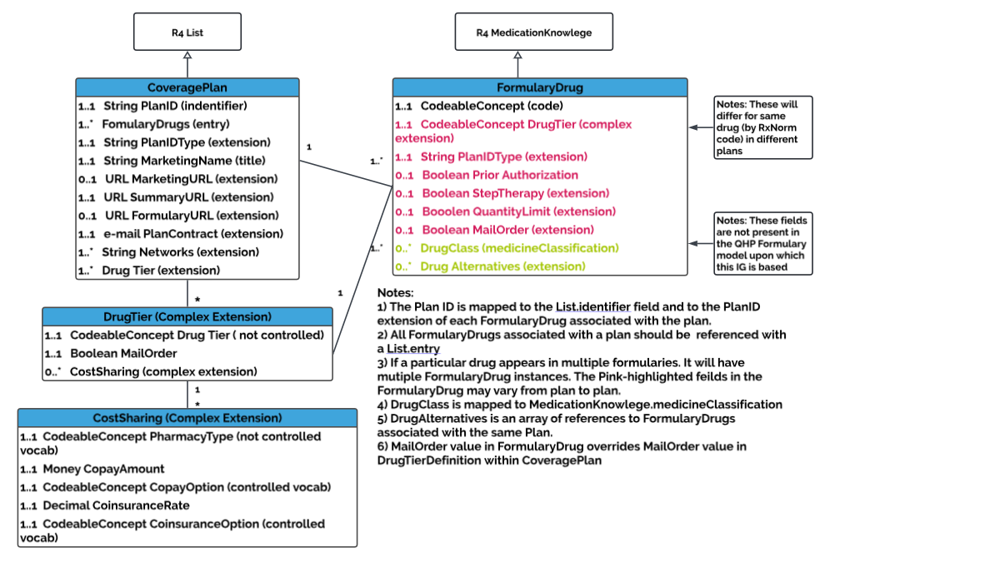
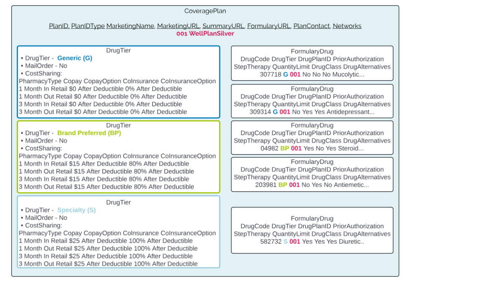
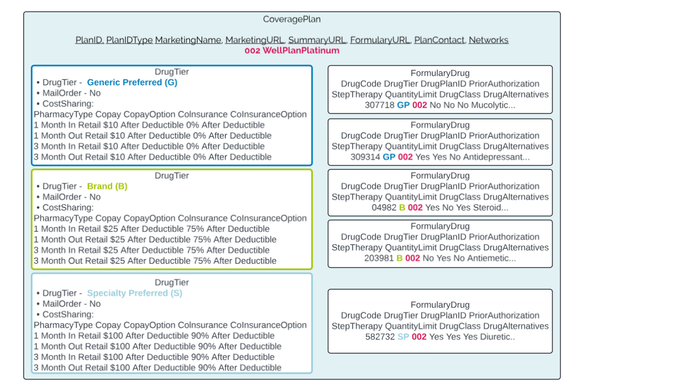

# Formulary_V6.2 Implementation Guide

**HLX0123 HLX Formulary_V6.2 IG (XSD_V6.1)**

**Version 6.1**

**May 29, 2026**

**Table of Contents**

1. [Overview](#overview)
2. [Encoding](#encoding)
3. [Interoperability](#interoperability)
4. [Change Log](#change-log)
5. [Simple Types](#simple-types)
6. [Complex Types](#complex-types)
7. [Required Elements of Formulary_V6.2 XSD](#required-elements-of-formulary_v6.2-xsd)
8. [All Elements of Formulary_V6.2 XSD](#all-elements-of-formulary_v6.2-xsd)
9. [Submission Frequency](#submission-frequency)
10. [Adds, Updates, and Deletes](#adds-updates-and-deletes)
11. [Plan and Drug Identification](#plan-and-drug-identification)
12. [Appendix A – Value Sets](#appendix-a-value-sets)
13. [Appendix B – Architecture](#appendix-b-architecture)
14. [Appendix Overall Implementation](#appendix-overall-implementation)

<h2 style="color:#E60073">Disclaimer</h2>

This document is provided by HealthLX for informational purposes only. Information within this document is believed to be correct as of the noted date of publication. Although HealthLX makes every reasonable effort to present information in a timely and accurate manner, HealthLX does not warrant this information for accuracy, completeness or fitness for any purpose, express or implied. The information provided herein does not constitute the rendering of legal, financial or other professional advice or recommendations by HealthLX.

<h2 id="overview" style="color:#E60073">Overview</h2>

This implementation guide provides field mappings and requirements for HealthLX Formulary_V6.2 data submissions in XML format based on FHIR R4 standards. XML format enables structured data exchange with built-in validation against the provided XSD schema.

<h2 id="encoding" style="color:#E60073">Encoding</h2>

Payers need to send their files with utf-8 encoding as shown below:

```xml
<?xml version="1.0" encoding="utf-8"?>
```

<h2 id="interoperability" style="color:#E60073">Interoperability</h2>

This implementation guide is based on constructs presented in FHIR R4 (Fast Healthcare Interoperability Resources Release 4) and associated FHIR Implementation Guides, such as those found in Da Vinci and CARIN.

For more information regarding these underlying standards, please visit:

- FHIR R4: https://www.hl7.org/fhir/R4/
- Da Vinci Project: https://confluence.hl7.org/display/DVP/Da+Vinci+Welcome
- CARIN Alliance: https://confluence.hl7.org/display/CAR/CARIN+Alliance+Implementation+Guides

<h2 id="change-log" style="color:#E60073">Change Log</h2>

| Version | Date |
|---------|------|
| manual | May 29, 2026 |
{: .heatMap}

<h2 id="simple-types" style="color:#E60073"> Simple Types</h2>

| Name | Base Type | Description | Pattern |
| --- | --- | --- | --- |
| string | xs:string | – | .+ |
| decimal | xs:decimal | – | -?(0\|[1-9][0-9]*)(\.[0-9]+)?([eE][+-]?[0-9]+)? |
| boolean | xs:boolean | – | true\|false |
| date | xs:date | – | ([12]\d{3}-(0[1-9]\|1[0-2])-(0[1-9]\|[12]\d\|3[01])) |
| dateTime | xs:string | – | ([12]\d{3})-(0[1-9]\|1[0-2])-(0[1-9]\|[1-2][0-9]\|3[0-1])(T([01][0-9]\|2[0-3]):[0-5][0-9]:[0-5][0-9](\.\d{1,6})?((Z\|(\+\|-)((0[0-9]\|1[0-3]):(00\|15\|30\|45)\|14:00))?))? |
| currency | string | – |  |
{: .heatMap}


<h2 id="complex-types" style="color:#E60073"> Complex Types</h2>

<h3 style="color:#E60073">quantity</h3>

| Field Name | Type | MinOccurs | MaxOccurs | Description |
| --- | --- | --- | --- | --- |
| value | decimal | 0 | 1 | – |
| comparator | – | 0 | 1 | A list of Quantity Comparator's can be found here: http://hl7.org/fhir/R4/valueset-quantity-comparator.html |
| unit | string | 0 | 1 | Unit representation (e.g. mcg) |
| system | string | 0 | 1 | The URI of the system that defines the coded unit form |
| code | string | 0 | 1 | Coded form of the unit |
{: .heatMap}


<h3 style="color:#E60073">formulary_drugs</h3>

| Field Name | Type | MinOccurs | MaxOccurs | Description |
| --- | --- | --- | --- | --- |
| formulary_drug | – | 1 | unbounded | – |
| id | string | 0 | 1 | – |
| rx_norm_code | – | 1 | 1 | A list of RxNorm Codes can be found here: http://hl7.org/fhir/us/core/STU3/ValueSet-us-core-medication-codes.html |
| code | xs:string | 0 | 1 | – |
| display | xs:string | 0 | 1 | – |
| system | xs:string | 0 | 1 | – |
| text | xs:string | 0 | 1 | – |
| status | – | 0 | 1 | Status of medication. Status options can be found here: http://hl7.org/fhir/R4/valueset-medicationknowledge-status.html |
| manufacturer | – | 0 | 1 | Manufacturer of the medication |
| name | string | 1 | 1 | – |
| alias | string | 0 | unbounded | – |
| type | – | 0 | unbounded | Select the type of orginzation this is. A full list can be found here: http://hl7.org/fhir/R4/valueset-organization-type.html |
| dose_form | – | 0 | 1 | Select the dose form. A full list can be found here: http://hl7.org/fhir/R4/valueset-medication-form-codes.html |
| code | – | 0 | 1 | – |
| system | – | 0 | 1 | – |
| display | string | 0 | 1 | – |
| text | string | 0 | 1 | – |
| ingredients | – | 0 | 1 | – |
| ingredient | – | 0 | unbounded | Ingredients of the medication |
| is_active | boolean | 0 | 1 | – |
| strength | – | 0 | 1 | Quantity of ingredient present |
| numerator | quantity | 0 | 1 | – |
| denominator | quantity | 0 | 1 | – |
| substance | – | 1 | 1 | – |
| category | – | 0 | unbounded | Select the substance categories. A full list can be found here: http://hl7.org/fhir/R4/valueset-substance-category.html |
| description | string | 1 | 1 | – |
| code | – | 1 | 1 | – |
| code | – | 1 | 1 | Select what substance this is. A full list can be found here: http://hl7.org/fhir/R4/valueset-substance-code.html |
| system | – | 0 | 1 | – |
| intended_route | – | 0 | unbounded | – |
| code | string | 0 | 1 | – |
| system | string | 0 | 1 | – |
| display | string | 0 | 1 | – |
| text | string | 0 | 1 | – |
| monitoring_programs | – | 0 | 1 | – |
| monitoring_program | – | 0 | unbounded | Program under which a medication is reviewed |
| name | string | 0 | 1 | – |
| type | string | 0 | 1 | Type of program under which the medication is monitored |
| monographs | – | 0 | 1 | – |
| monograph | – | 0 | unbounded | Associated documentation about the medication |
| type | string | 0 | 1 | The category of medication document |
| cost_informations | – | 0 | 1 | – |
| cost_information | – | 0 | unbounded | The price of the medication |
| type | string | 1 | 1 | The category of the cost information. For example, manufacturers' cost, patient cost, claim reimbursement cost, actual acquisition cost. |
| source | string | 0 | 1 | The source or owner for the price information |
| cost | – | 1 | 1 | The actual cost of the medication |
| value | decimal | 0 | 1 | – |
| currency | currency | 0 | 1 | Currency codes which can be found here: http://hl7.org/fhir/R4/valueset-currencies.html |
| plan_id | string | 1 | 1 | Plan IDs must be unique, even across different markets. |
| prior_authorization | boolean | 0 | 1 | A Boolean indication of whether the coverage plan imposes a prior authorization requirement on this drug |
| step_therapy | boolean | 0 | 1 | A Boolean indication of whether the coverage plan imposes a step therapy limit on this drug |
| quantity_limit | boolean | 0 | 1 | A Boolean indication of whether the coverage plan imposes a quantity limit on this drug |
| medicine_classifications | – | 0 | 1 | – |
| medicine_classification | – | 0 | unbounded | The type of category for the medication (for example, therapeutic classification, therapeutic sub-classification) |
| type | string | 1 | 1 | – |
| classification | string | 0 | unbounded | – |
| formulary_drugs_alternatives | formulary_drugs_alternatives | 0 | 1 | – |
{: .heatMap}


<h3 style="color:#E60073">formulary_drugs_alternatives</h3>

| Field Name | Type | MinOccurs | MaxOccurs | Description |
| --- | --- | --- | --- | --- |
| formulary_drugs_alternative | – | 0 | unbounded | – |
| rx_norm_code | – | 1 | 1 | A list of RxNorm Codes can be found here: http://hl7.org/fhir/us/core/STU3/ValueSet-us-core-medication-codes.html |
| code | string | 1 | 1 | – |
| display | string | 1 | 1 | – |
| system | – | 1 | 1 | – |
| status | – | 0 | 1 | Status of medication. Status options can be found here: http://hl7.org/fhir/R4/valueset-medicationknowledge-status.html |
| manufacturer | – | 0 | 1 | Manufacturer of the medication |
| name | string | 1 | 1 | – |
| alias | string | 0 | unbounded | – |
| type | – | 0 | unbounded | Select the type of orginzation this is. A full list can be found here: http://hl7.org/fhir/R4/valueset-organization-type.html |
| dose_form | – | 0 | 1 | Select the dose form. A full list can be found here: http://hl7.org/fhir/R4/valueset-medication-form-codes.html |
| code | – | 0 | 1 | – |
| system | – | 0 | 1 | – |
| ingredients | – | 0 | 1 | – |
| ingredient | – | 0 | unbounded | Ingredients of the medication |
| is_active | boolean | 0 | 1 | – |
| strength | – | 0 | 1 | Quantity of ingredient present |
| numerator | quantity | 0 | 1 | – |
| denominator | quantity | 0 | 1 | – |
| substance | – | 1 | 1 | – |
| category | – | 0 | unbounded | Select the substance categories. A full list can be found here: http://hl7.org/fhir/R4/valueset-substance-category.html |
| description | string | 1 | 1 | – |
| code | – | 1 | 1 | – |
| code | – | 1 | 1 | Select what substance this is. A full list can be found here: http://hl7.org/fhir/R4/valueset-substance-code.html |
| system | – | 0 | 1 | – |
| monitoring_programs | – | 0 | 1 | – |
| monitoring_program | – | 0 | unbounded | Program under which a medication is reviewed |
| name | string | 0 | 1 | – |
| type | string | 0 | 1 | Type of program under which the medication is monitored |
| monographs | – | 0 | 1 | – |
| monograph | – | 0 | unbounded | Associated documentation about the medication |
| type | string | 0 | 1 | The category of medication document |
| cost_informations | – | 0 | 1 | – |
| cost_information | – | 0 | unbounded | The price of the medication |
| type | string | 1 | 1 | The category of the cost information. For example, manufacturers' cost, patient cost, claim reimbursement cost, actual acquisition cost. |
| source | string | 0 | 1 | The source or owner for the price information |
| cost | – | 1 | 1 | The actual cost of the medication |
| value | decimal | 0 | 1 | – |
| currency | currency | 0 | 1 | Currency codes which can be found here: http://hl7.org/fhir/R4/valueset-currencies.html |
| plan_id | string | 1 | 1 | Plan IDs must be unique, even across different markets |
| prior_authorization | boolean | 0 | 1 | A Boolean indication of whether the coverage plan imposes a prior authorization requirement on this drug |
| step_therapy | boolean | 0 | 1 | A Boolean indication of whether the coverage plan imposes a step therapy limit on this drug |
| quantity_limit | boolean | 0 | 1 | A Boolean indication of whether the coverage plan imposes a quantity limit on this drug |
| medicine_classifications | – | 0 | 1 | – |
| medicine_classification | – | 0 | unbounded | The type of category for the medication (for example, therapeutic classification, therapeutic sub-classification) |
| type | string | 1 | 1 | – |
| classification | string | 0 | unbounded | – |
{: .heatMap}


<h2 id="required-elements-of-formulary_v6.2-xsd" style="color:#E60073">Required Elements of Formulary_V6.2 XSD</h2>

| Name | Parent | Cardinality | Description | Examples | Data Type |
| --- | --- | --- | --- | --- | --- |
| coverage_plans |  | 1..1 | The CoveragePlan resource represents a health plan health plan and contains links to administrative information, a list of formulary drugs covered under that plan, and a definition of drug tiers and their associated cost-sharing models | – | – |
| schema_version | coverage_plans | 1..1 | This element defines what version of the roster schema you will be validating against (e.g. 1.0) | – | xs:decimal |
| sender_id | coverage_plans | 1..1 | This element is used to the unique identifier assigned to your organization | – | string |
| date_time_reported | coverage_plans | 1..1 | This element is used to the identify the date time this information was reported (e.g. 2001-10-26T21:32:52+02:00) | – | xs:dateTime |
| coverage_plan | coverage_plans | 1..unbounded | – | – | – |
| plan_id | coverage_plan | 1..1 | – | – | string |
| plan_id_type | coverage_plan | 1..1 | Type of Plan ID. For all Marketplace plans this should be: HIOS-PLAN-ID. Other recommended values: commercial, QHP, Medicare Advantage, Medicaid, Dental Plan, vision, Indian Health Service etc | – | string |
| title | coverage_plan | 1..1 | – | – | string |
| status | coverage_plan | 1..1 | The CoveragePlan Status (current, retired, entered-in-error). More details can be found here: http://hl7.org/fhir/R4/valueset-list-status.html | – | – |
| mode | coverage_plan | 1..1 | The CoveragePlan Mode (working, snapshot, changes). More details can be found here: http://hl7.org/fhir/R4/valueset-list-mode.html | – | – |
| drug_tiers | coverage_plan | 1..1 | A description of the drug tiers used by the formulary and how those tiers implement copay and coinsurance amounts. Drug tiers do not have any inherent meaning that is consistent across all formularies. Rather, each tier is defined using this element. | – | – |
| drug_tier | drug_tiers | 1..unbounded | The drug tier of a particular medication in a health plan. Base set are examples. Each plan may have its own controlled vocabulary. | – | – |
| drug_tier_id | drug_tier | 1..1 | – | – | – |
| mail_order | drug_tier | 1..1 | – | – | boolean |
| pharmacy_type | cost_sharing | 1..1 | Types of Pharmacies. Each payer will have its own controlled vocabulary. More inoformation can be found here: http://hl7.org/fhir/us/Davinci-drug-formulary/ValueSet-usdf-PharmacyTypeVS.html | – | – |
| copay_amount | cost_sharing | 1..1 | – | – | – |
| copay_option | cost_sharing | 1..1 | Copay options which can be found here: http://hl7.org/fhir/us/Davinci-drug-formulary/ValueSet-usdf-CopayOptionVS.html | – | – |
| coinsurance_rate | cost_sharing | 1..1 | – | – | decimal |
| coinsurance_option | cost_sharing | 1..1 | CoInsurance options which can be found here: http://hl7.org/fhir/us/Davinci-drug-formulary/ValueSet-usdf-CoinsuranceOptionVS.html | – | – |
| formulary_drugs | drug_tier | 1..1 | – | – | formulary_drugs |
{: .heatMap}


<h2 id="all-elements-of-formulary_v6.2-xsd" style="color:#E60073">All Elements of Formulary_V6.2 XSD</h2>

<h3 style="color:#E60073">Root Elements</h3>

| Name | Parent | Cardinality | Description | Examples | Data Type |
| --- | --- | --- | --- | --- | --- |
| coverage_plans |  | 1..1 | The CoveragePlan resource represents a health plan health plan and contains links to administrative information, a list of formulary drugs covered under that plan, and a definition of drug tiers and their associated cost-sharing models | – | – |
| schema_version | coverage_plans | 1..1 | This element defines what version of the roster schema you will be validating against (e.g. 1.0) | – | xs:decimal |
| sender_id | coverage_plans | 1..1 | This element is used to the unique identifier assigned to your organization | – | string |
| date_time_reported | coverage_plans | 1..1 | This element is used to the identify the date time this information was reported (e.g. 2001-10-26T21:32:52+02:00) | – | xs:dateTime |
| coverage_plan | coverage_plans | 1..unbounded | – | – | – |
| plan_id | coverage_plan | 1..1 | – | – | string |
| plan_id_type | coverage_plan | 1..1 | Type of Plan ID. For all Marketplace plans this should be: HIOS-PLAN-ID. Other recommended values: commercial, QHP, Medicare Advantage, Medicaid, Dental Plan, vision, Indian Health Service etc | – | string |
| title | coverage_plan | 1..1 | – | – | string |
| marketing_url | coverage_plan | 0..1 | The URL that goes directly to the plan brochure for the specific standard plan or plan variation | – | string |
| summary_url | coverage_plan | 0..1 | The URL that goes directly to the formulary brochure for the specific standard plan or plan variation. | – | string |
| formulary_url | coverage_plan | 0..1 | The URL that goes directly to the formulary brochure for the specific standard plan or plan variation. | – | string |
| email_plan_contact | coverage_plan | 0..1 | – | – | string |
| network | coverage_plan | 0..unbounded | – | – | string |
| status | coverage_plan | 1..1 | The CoveragePlan Status (current, retired, entered-in-error). More details can be found here: http://hl7.org/fhir/R4/valueset-list-status.html | – | – |
| mode | coverage_plan | 1..1 | The CoveragePlan Mode (working, snapshot, changes). More details can be found here: http://hl7.org/fhir/R4/valueset-list-mode.html | – | – |
| date | coverage_plan | 0..1 | – | – | dateTime |
| drug_tiers | coverage_plan | 1..1 | A description of the drug tiers used by the formulary and how those tiers implement copay and coinsurance amounts. Drug tiers do not have any inherent meaning that is consistent across all formularies. Rather, each tier is defined using this element. | – | – |
| drug_tier | drug_tiers | 1..unbounded | The drug tier of a particular medication in a health plan. Base set are examples. Each plan may have its own controlled vocabulary. | – | – |
| drug_tier_id | drug_tier | 1..1 | – | – | – |
| code | drug_tier_id | 0..1 | – | – | – |
| text | drug_tier_id | 0..1 | – | – | string |
| mail_order | drug_tier | 1..1 | – | – | boolean |
| cost_sharings | drug_tier | 0..1 | – | – | – |
| cost_sharing | cost_sharings | 0..unbounded | – | – | – |
| pharmacy_type | cost_sharing | 1..1 | Types of Pharmacies. Each payer will have its own controlled vocabulary. More inoformation can be found here: http://hl7.org/fhir/us/Davinci-drug-formulary/ValueSet-usdf-PharmacyTypeVS.html | – | – |
| copay_amount | cost_sharing | 1..1 | – | – | – |
| value | copay_amount | 0..1 | – | – | decimal |
| currency | copay_amount | 0..1 | Currency codes which can be found here: http://hl7.org/fhir/R4/valueset-currencies.html | – | currency |
| copay_option | cost_sharing | 1..1 | Copay options which can be found here: http://hl7.org/fhir/us/Davinci-drug-formulary/ValueSet-usdf-CopayOptionVS.html | – | – |
| coinsurance_rate | cost_sharing | 1..1 | – | – | decimal |
| coinsurance_option | cost_sharing | 1..1 | CoInsurance options which can be found here: http://hl7.org/fhir/us/Davinci-drug-formulary/ValueSet-usdf-CoinsuranceOptionVS.html | – | – |
| formulary_drugs | drug_tier | 1..1 | – | – | formulary_drugs |
{: .heatMap}


<h2 id="submission-frequency" style="color:#E60073">Submission Frequency</h2>

Formulary_V6.2 files should be submitted according to the schedule agreed upon with HealthLX. Typical submission frequencies include daily, weekly, or monthly updates.

<h2 id="adds-updates-and-deletes" style="color:#E60073">Adds, Updates, and Deletes</h2>

When data in a formulary file is changed after it has already been ingested/processed by HealthLX, a full replacement file must be sent for any changes that may have been made. The new file will completely replace the original data. If a record must be deleted, please contact HealthLX for support.

<h2 id="plan-and-drug-identification" style="color:#E60073">Plan and Drug Identification</h2>

Each coverage plan must be uniquely identified using the `plan_id`, and each drug uniquely identified by its `rx_norm_code`. Ensure consistency in these identifiers across all submissions to maintain data integrity.

<h2 id="appendix-a-value-sets" style="color:#E60073">Appendix A – Value Sets</h2>

These value sets were updated July 23, 2020. For updated value sets, visit [https://hl7.org/fhir/R4/index.html](https://hl7.org/fhir/R4/index.html).

<h3 style="color:#E60073">DrugTierID Codes</h3>

The following DrugTierID Codes can be found here: [http://hl7.org/fhir/us/Davinci-drug-formulary/ValueSet-usdf-DrugTierVS.html](http://hl7.org/fhir/us/Davinci-drug-formulary/ValueSet-usdf-DrugTierVS.html)

| Code | Display | Definition |
| --- | --- | --- |
| generic | Generic | Commonly prescribed generic drugs that cost more than drugs in the 'preferred-generic' tier. |
| preferred-generic | Preferred Generic | Commonly prescribed generic drugs. |
| non-preferred-generic | Non-preferred Generic | Generic drugs that cost more than drugs in the 'generic' tier. |
| specialty | Specialty | Drugs used to treat complex conditions like cancer and multiple sclerosis. They can be generic or brand-name and are typically the most expensive drugs on the formulary. |
| brand | Brand | Brand-name drugs that cost more than 'preferred-brand' drugs. |
| preferred-brand | Preferred Brand | Brand-name drugs |
| non-preferred-brand | Non-preferred Brand | Brand-name drugs that cost more than 'brand' drugs. |
| zero-cost-share-preventive | Zero-cost-share preventive | Preventive medications and products available at no cost. |
| medical-service | Medical Service | Drugs that must be administered by a clinician or in a facility and may be covered under a medical benefit. |
{: .heatMap}

<h3 style="color:#E60073">PharmacyType Codes</h3>

The following PharmacyType Codes can be found here: [http://hl7.org/fhir/us/Davinci-drug-formulary/ValueSet-usdf-PharmacyTypeVS.html](http://hl7.org/fhir/us/Davinci-drug-formulary/ValueSet-usdf-PharmacyTypeVS.html)

| Code | Display | Definition |
| --- | --- | --- |
| 1-month-in-retail | 1 month in network retail | 1-month supply via in-network retail pharmacy. |
| 1-month-out-retail | 1 month out of network retail | 1-month supply via out-of-network retail pharmacy. |
| 1-month-in-mail | 1 month in network mail order | 1-month supply via in-network mail order pharmacy. |
| 1-month-out-mail | 1 month out of network mail order | 1-month supply via out-of-network mail order pharmacy. |
| 3-month-in-retail | 3 month in network retail | 3-month supply via in-network retail pharmacy. |
| 3-month-out-retail | 3 month out of network retail | 3-month supply via out-of-network retail pharmacy. |
| 3-month-in-mail | 3 month in network mail order | 3-month supply via in-network mail order pharmacy. |
| 3-month-out-mail | 3 month out of network mail order | 3-month supply via out-of-network mail order pharmacy. |
{: .heatMap}

<h3 style="color:#E60073">Currency Codes</h3>

The currency codes list is too large to be included in this guide. An up-to-date version can be found here: [http://hl7.org/fhir/R4/valueset-currencies.html](http://hl7.org/fhir/R4/valueset-currencies.html)

<h3 style="color:#E60073">Copay Options Codes</h3>

The following copay options codes can be found here: [http://hl7.org/fhir/us/Davinci-drug-formulary/ValueSet-usdf-CopayOptionVS.html](http://hl7.org/fhir/us/Davinci-drug-formulary/ValueSet-usdf-CopayOptionVS.html)

| Code | Display | Definition |
| --- | --- | --- |
| after-deductible | After Deductible | The consumer first pays the deductible, and after the deductible is met, the consumer is responsible only for the copay (it indicates that this benefit is subject to the deductible). |
| before-deductible | Before Deductible | The consumer first pays the copay, and any net remaining allowed charges accrue to the deductible (it indicates that this benefit is subject to the deductible). |
| no-charge | No Charge | No cost sharing is charged (this indicates that this benefit is not subject to the deductible). |
| no-charge-after-deductible | No Charge After Deductible | The consumer first pays the deductible, and after the deductible is met, no copayment is charged (it indicates that this benefit is subject to the deductible). |
{: .heatMap}

<h3 style="color:#E60073">Coinsurance Options</h3>

The following Coinsurance options codes can be found here: [http://hl7.org/fhir/us/Davinci-drug-formulary/ValueSet-usdf-CoinsuranceOptionVS.html](http://hl7.org/fhir/us/Davinci-drug-formulary/ValueSet-usdf-CoinsuranceOptionVS.html)

| Code | Display | Definition |
| --- | --- | --- |
| after-deductible | After Deductible | The consumer first pays the deductible, and after the deductible is met, the consumer pays the coinsurance portion of allowed charges (it indicates that this benefit is subject to the deductible). |
| no-charge | No Charge | No cost sharing is charged (it indicates that this benefit is not subject to the deductible). |
| no-charge-after-deductible | No Charge After Deductible | The consumer first pays the deductible, and after the deductible is met, no coinsurance is charged (it indicates that this benefit is subject to the deductible). |
{: .heatMap}

<h3 style="color:#E60073">RxNorm Codes</h3>

The RxNorm codes list is too large to be included in this guide. An up-to-date version can be found here: [http://hl7.org/fhir/us/core/STU3/ValueSet-us-core-medication-codes.html](http://hl7.org/fhir/us/core/STU3/ValueSet-us-core-medication-codes.html)

<h3 style="color:#E60073">Medication Knowledge Status Codes</h3>

The following medication knowledge status codes can be found here: [http://hl7.org/fhir/R4/valueset-medicationknowledge-status.html](http://hl7.org/fhir/R4/valueset-medicationknowledge-status.html)

| Code | Display | Definition |
| --- | --- | --- |
| active | Active | The medication is available for use. |
| inactive | Inactive | The medication is not available for use. |
| entered-in-error | Entered in Error | The medication was entered in error. |
{: .heatMap}

<h3 style="color:#E60073">Organization Type Codes</h3>

The following organization type codes can be found here: [http://hl7.org/fhir/R4/valueset-organization-type.html](http://hl7.org/fhir/R4/valueset-organization-type.html)

| Code | Display | Definition |
| --- | --- | --- |
| prov | Healthcare Provider | An organization that provides healthcare services. |
| dept | Hospital Department | A department or ward within a hospital (generally is not applicable to top-level organizations). |
| team | Organizational team | An organizational team is usually a grouping of practitioners that perform a specific function within an organization (which could be a top-level organization or a department). |
| govt | Government | A political body, often used when including organization records for government bodies such as a federal government, state or local government. |
| ins | Insurance Company | A company that provides insurance to its subscribers and may include healthcare related policies. |
| pay | Payer | A company, charity or governmental organization, which processes claims and/or issues payments to providers on behalf of patients or groups of patients. |
| edu | Educational Institute | An educational institution that provides education or research facilities. |
| reli | Religious Institution | An organization that is identified as a part of a religious institution. |
| crs | Clinical Research Sponsor | An organization that is identified as a pharmaceutical/clinical research sponsor. |
| cg | Community Group | An unincorporated community group. |
| bus | Non-Healthcare Business or Corporation | An organization that is a registered business or corporation but not identified by other types. |
| other | Other | Other types of organization not already specified. |
{: .heatMap}

<h3 style="color:#E60073">DoseForm Codes</h3>

The DoseForm codes list is too large to be included in this guide. An up-to-date version can be found here: [http://hl7.org/fhir/R4/valueset-medication-form-codes.html](http://hl7.org/fhir/R4/valueset-medication-form-codes.html)

<h3 style="color:#E60073">Substance Category Codes</h3>

The following substance category codes can be found here: [http://hl7.org/fhir/R4/valueset-substance-category.html](http://hl7.org/fhir/R4/valueset-substance-category.html)

| Code | Display | Definition |
| --- | --- | --- |
| allergen | Allergen | A substance that causes an allergic reaction. |
| biological | Biological Substance | A substance that is produced by or extracted from a biological source. |
| body | Body Substance | A substance that comes directly from a human or an animal (e.g. blood, urine, feces, tears, etc.). |
| chemical | Chemical | Any organic or inorganic substance of a particular molecular identity, including (i) any combination of such substances occurring in whole or in part as a result of a chemical reaction or occurring in nature and (ii) any element or uncombined radical (http://www.epa.gov/opptintr/import-export/pubs/importguide.pdf). |
| food | Dietary Substance | A food, dietary ingredient, or dietary supplement for human or animal. |
| drug | Drug or Medicament | A substance intended for use in the diagnosis, cure, mitigation, treatment, or prevention of disease in man or other animals (Federal Food Drug and Cosmetic Act). |
| material | Material | A finished product which is not normally ingested, absorbed or injected (e.g. steel, iron, wood, plastic and paper). |
{: .heatMap}

<h3 style="color:#E60073">Substance Codes</h3>

The substance codes list is too large to be included in this guide. An up-to-date version can be found here: [http://hl7.org/fhir/R4/valueset-substance-code.html](http://hl7.org/fhir/R4/valueset-substance-code.html)

<h2 id="appendix-b-architecture" style="color:#E60073">Appendix B – Architecture</h2>

The overall architecture for implementation of the schema is based on the following two references:

- [Da Vinci PDEX Formulary Client](https://davinci-pdex-formulary-client.logicahealth.org/)
- [http://hl7.org/fhir/us/Davinci-drug-formulary/](http://hl7.org/fhir/us/Davinci-drug-formulary/)

The `CoveragePlan` profile of the [https://www.hl7.org/fhir/R4/](https://www.hl7.org/fhir/R4/) `List` resource provides links to information about the plan and formulary, contact information, a description of the `drugTiers` and associated cost sharing models of the plan, and a list of `FormularyDrug` resources.

The `FormularyDrug` profile of the FHIR R4 `MedicationKnowledge` resource provides plan-specific information about a prescribable drug identified by an [RxNorm](https://www.nlm.nih.gov/research/umls/rxnorm/index.html) identifier. Cost sharing for the drug is described by reference to a drug tier defined as part of the coverage plan. Extensions to the `MedicationKnowledge` resource support important search use cases. Due to the immaturity of the `MedicationKnowledge` resource, it is expected that it will undergo changes, and those changes may require evolution of the `FormularyDrug` profile.



The following diagram shows a logical model of the implementation. There are two defined coverage plans, and within those coverage plans are drug tiers that can be defined arbitrarily from one plan to the next, including number, names, and cost-sharing details. It is important to note that even though multiple plans contain the same drug, that drug can be classified differently in terms of tier, prior auth, step therapy, and quantity limit.





<h2 id="appendix-overall-implementation" style="color:#E60073">Appendix Overall Implementation</h2>

The following diagram depicts all data types and how they are integrated:


